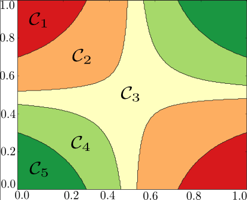
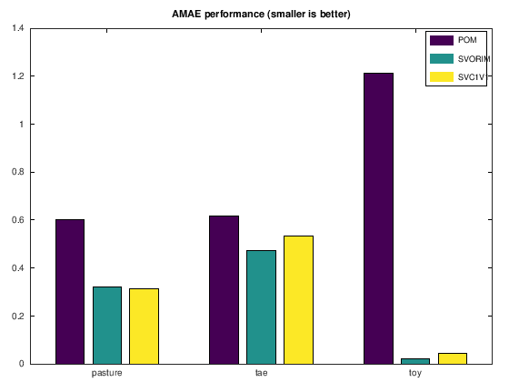
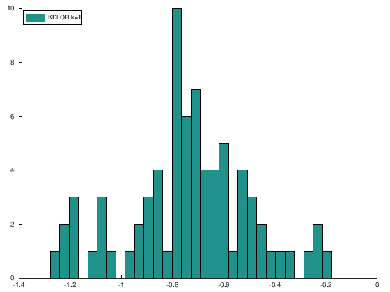
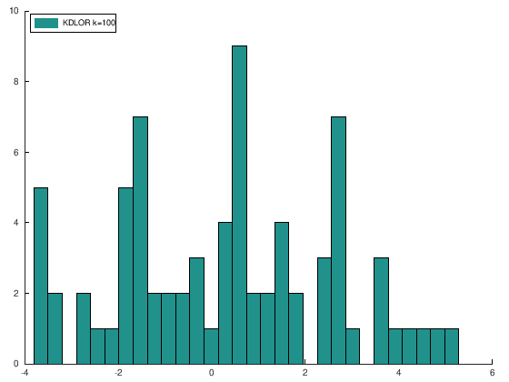
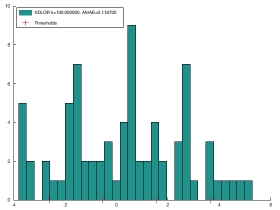

1. [How to use ORCA](#how-to-use-orca)
	1. [Launch experiments through `ini` files](#launch-experiments-through-ini-files)
		1. [Syntax of `ini` files](#syntax-of-ini-files)
		2. [Hyper-parameter optimization](#hyper-parameter-optimization)
		3. [Experimental results and reports](#experimental-results-and-reports)
	2. [Running algorithms with ORCA API](#running-algorithms-with-orca-api)
		1. [Run a pair of train-test files with fitpredict](#run-a-pair-of-train-test-files-with-fitpredict)
		2. [Using performance metrics](#using-performance-metrics)
		3. [Visualizing projections](#visualizing-projections)
		4. [Visualizing projections and decision thresholds](#visualizing-projections-and-decision-thresholds)
	3. [Using ORCA with your own datasets](#using-orca-with-your-own-datasets)
		1. [Data format](#data-format)
		2. [Data partitions for the experiments](#data-partitions-for-the-experiments)
		3. [Generating your own partitions](#generating-your-own-partitions)
		4. [Warning about highly imbalanced datasets](#warning-about-highly-imbalanced-datasets)
2. [References](#references)

# How to use ORCA

ORCA is an experimental framework focused on productivity and experiments reproducibility for machine learning researchers. Although initially created to collect ordinal classification methods, it is also suitable for other classifiers.

First, you will need to install the framework. To do so, please visit [ORCA Quick Install Guide](orca_quick_install.md). Note that you should be able to perform the test when the framework is successfully installed.

This tutorial uses three small datasets (`pasture`, `tae`, `toy`) contained in folder [example data](../exampledata/30-holdout). The datasets are already partitioned with a 30-holdout experimental design.

This tutorial has been tested in Octave 4.2 and 4.4, but it should work with minor changes in Matlab. 

*NOTE:*

Small datasets like the ones used in this tutorial usually produce warning messages such as:
```MATLAB
Warning: Matrix is close to singular or badly scaled. Results may be inaccurate. RCOND =
1.747151e-17.
Warning: Maximum likelihood estimation did not converge.  Iteration limit
exceeded.  You may need to merge categories to increase observed counts.

```

You can disable these messages by using the following code in Matlab:
```MATLAB
warning('off','MATLAB:nearlySingularMatrix')
warning('off','stats:mnrfit:IterOrEvalLimit')
```

In Octave, to disable `warning: matrix singular to machine precision` we need to disable all the warnings: 
```MATLAB
warning('off','all');
```

## Launch experiments through `ini` files

In this section, we run several experiments to compare the performance of three methods in a set of datasets: POM (Proportional Odds Model) [1], SVORIM (Support Vector Machines with IMplicit constrains) [2] and SVC1V1 (SVM classifier with 1-vs-1 binary decomposition) [3]. POM is a linear ordinal model, with limited performance but easy interpretation. SVORIM is an ordinal nonlinear model, with one of the most competitive performances according to several studies. SVC1V1 is the nominal counterpart of SVORIM, so that we can check the benefits of considering the order of the classes. To learn more about ordinal performance metrics see [4].

From the Octave console load packages and add orca files to path:


```octave
% Install dataframe, add src to path and disable some warnings
pkg install -forge dataframe
warning('off','all');

addpath('../src/Algorithms/')
addpath('../src/Measures/')
addpath('../src/Utils/')

```

    For information about changes from previous versions of the dataframe package, run 'news dataframe'.


The set of experiments described in INI file `tutorial/config-files/pom.ini` can be run by (the syntax of these files will be explained in the [next subsection](#Syntax-of-ini-files)):


```octave
Utilities.runExperiments('tutorial/config-files/pom.ini')
```

    Setting up experiments...
    Running experiment exp-pom-tutorial-pasture-1.ini
    Running experiment exp-pom-tutorial-pasture-10.ini
    Running experiment exp-pom-tutorial-pasture-11.ini
    Running experiment exp-pom-tutorial-pasture-12.ini
    Running experiment exp-pom-tutorial-pasture-13.ini
    Running experiment exp-pom-tutorial-pasture-14.ini
    Running experiment exp-pom-tutorial-pasture-15.ini
    Running experiment exp-pom-tutorial-pasture-16.ini
    Running experiment exp-pom-tutorial-pasture-17.ini
    Running experiment exp-pom-tutorial-pasture-18.ini
    Running experiment exp-pom-tutorial-pasture-19.ini
    Running experiment exp-pom-tutorial-pasture-2.ini
    Running experiment exp-pom-tutorial-pasture-20.ini
    Running experiment exp-pom-tutorial-pasture-21.ini
    Running experiment exp-pom-tutorial-pasture-22.ini
    Running experiment exp-pom-tutorial-pasture-23.ini
    Running experiment exp-pom-tutorial-pasture-24.ini
    Running experiment exp-pom-tutorial-pasture-25.ini
    Running experiment exp-pom-tutorial-pasture-26.ini
    Running experiment exp-pom-tutorial-pasture-27.ini
    Running experiment exp-pom-tutorial-pasture-28.ini
    Running experiment exp-pom-tutorial-pasture-29.ini
    Running experiment exp-pom-tutorial-pasture-3.ini
    Running experiment exp-pom-tutorial-pasture-30.ini
    Running experiment exp-pom-tutorial-pasture-4.ini
    Running experiment exp-pom-tutorial-pasture-5.ini
    Running experiment exp-pom-tutorial-pasture-6.ini
    Running experiment exp-pom-tutorial-pasture-7.ini
    Running experiment exp-pom-tutorial-pasture-8.ini
    Running experiment exp-pom-tutorial-pasture-9.ini
    Running experiment exp-pom-tutorial-tae-1.ini
    Running experiment exp-pom-tutorial-tae-10.ini
    Running experiment exp-pom-tutorial-tae-11.ini
    Running experiment exp-pom-tutorial-tae-12.ini
    Running experiment exp-pom-tutorial-tae-13.ini
    Running experiment exp-pom-tutorial-tae-14.ini
    Running experiment exp-pom-tutorial-tae-15.ini
    Running experiment exp-pom-tutorial-tae-16.ini
    Running experiment exp-pom-tutorial-tae-17.ini
    Running experiment exp-pom-tutorial-tae-18.ini
    Running experiment exp-pom-tutorial-tae-19.ini
    Running experiment exp-pom-tutorial-tae-2.ini
    Running experiment exp-pom-tutorial-tae-20.ini
    Running experiment exp-pom-tutorial-tae-21.ini
    Running experiment exp-pom-tutorial-tae-22.ini
    Running experiment exp-pom-tutorial-tae-23.ini
    Running experiment exp-pom-tutorial-tae-24.ini
    Running experiment exp-pom-tutorial-tae-25.ini
    Running experiment exp-pom-tutorial-tae-26.ini
    Running experiment exp-pom-tutorial-tae-27.ini
    Running experiment exp-pom-tutorial-tae-28.ini
    Running experiment exp-pom-tutorial-tae-29.ini
    Running experiment exp-pom-tutorial-tae-3.ini
    Running experiment exp-pom-tutorial-tae-30.ini
    Running experiment exp-pom-tutorial-tae-4.ini
    Running experiment exp-pom-tutorial-tae-5.ini
    Running experiment exp-pom-tutorial-tae-6.ini
    Running experiment exp-pom-tutorial-tae-7.ini
    Running experiment exp-pom-tutorial-tae-8.ini
    Running experiment exp-pom-tutorial-tae-9.ini
    Running experiment exp-pom-tutorial-toy-1.ini
    Running experiment exp-pom-tutorial-toy-10.ini
    Running experiment exp-pom-tutorial-toy-11.ini
    Running experiment exp-pom-tutorial-toy-12.ini
    Running experiment exp-pom-tutorial-toy-13.ini
    Running experiment exp-pom-tutorial-toy-14.ini
    Running experiment exp-pom-tutorial-toy-15.ini
    Running experiment exp-pom-tutorial-toy-16.ini
    Running experiment exp-pom-tutorial-toy-17.ini
    Running experiment exp-pom-tutorial-toy-18.ini
    Running experiment exp-pom-tutorial-toy-19.ini
    Running experiment exp-pom-tutorial-toy-2.ini
    Running experiment exp-pom-tutorial-toy-20.ini
    Running experiment exp-pom-tutorial-toy-21.ini
    Running experiment exp-pom-tutorial-toy-22.ini
    Running experiment exp-pom-tutorial-toy-23.ini
    Running experiment exp-pom-tutorial-toy-24.ini
    Running experiment exp-pom-tutorial-toy-25.ini
    Running experiment exp-pom-tutorial-toy-26.ini
    Running experiment exp-pom-tutorial-toy-27.ini
    Running experiment exp-pom-tutorial-toy-28.ini
    Running experiment exp-pom-tutorial-toy-29.ini
    Running experiment exp-pom-tutorial-toy-3.ini
    Running experiment exp-pom-tutorial-toy-30.ini
    Running experiment exp-pom-tutorial-toy-4.ini
    Running experiment exp-pom-tutorial-toy-5.ini
    Running experiment exp-pom-tutorial-toy-6.ini
    Running experiment exp-pom-tutorial-toy-7.ini
    Running experiment exp-pom-tutorial-toy-8.ini
    Running experiment exp-pom-tutorial-toy-9.ini
    Calculating results...
    Experiments/exp-2019-7-23-10-53-40/Results/pasture-pom-tutorial/dataset
    Experiments/exp-2019-7-23-10-53-40/Results/tae-pom-tutorial/dataset
    Experiments/exp-2019-7-23-10-53-40/Results/toy-pom-tutorial/dataset
    Experiments/exp-2019-7-23-10-53-40/Results/pasture-pom-tutorial/dataset
    Experiments/exp-2019-7-23-10-53-40/Results/tae-pom-tutorial/dataset
    Experiments/exp-2019-7-23-10-53-40/Results/toy-pom-tutorial/dataset
    ans = Experiments/exp-2019-7-23-10-53-40


As can be observed, ORCA analyses all the files included in the folder of the dataset, where training and test partitions are included (a pair of files `train_dataset.X` and `test_dataset.X` for each dataset, where `X` is the number of partition). For each partition, a model is trained on training data and tested on test data.

After this, you can also run the experiments for SVORIM and SVC1V1:


```octave
Utilities.runExperiments('tutorial/config-files/svorim-3holdout.ini')
Utilities.runExperiments('tutorial/config-files/svc1v1-3holdout.ini')
```

    Setting up experiments...
    Running experiment exp-svorim-mae-tutorial-pasture-1.ini
    Running experiment exp-svorim-mae-tutorial-pasture-2.ini
    Running experiment exp-svorim-mae-tutorial-pasture-3.ini
    Running experiment exp-svorim-mae-tutorial-tae-1.ini
    Running experiment exp-svorim-mae-tutorial-tae-2.ini
    Running experiment exp-svorim-mae-tutorial-tae-3.ini
    Running experiment exp-svorim-mae-tutorial-toy-1.ini
    Running experiment exp-svorim-mae-tutorial-toy-2.ini
    Running experiment exp-svorim-mae-tutorial-toy-3.ini
    Calculating results...
    Experiments/exp-2019-7-23-10-54-2/Results/pasture-svorim-mae-tutorial/dataset
    Experiments/exp-2019-7-23-10-54-2/Results/tae-svorim-mae-tutorial/dataset
    Experiments/exp-2019-7-23-10-54-2/Results/toy-svorim-mae-tutorial/dataset
    Experiments/exp-2019-7-23-10-54-2/Results/pasture-svorim-mae-tutorial/dataset
    Experiments/exp-2019-7-23-10-54-2/Results/tae-svorim-mae-tutorial/dataset
    Experiments/exp-2019-7-23-10-54-2/Results/toy-svorim-mae-tutorial/dataset
    ans = Experiments/exp-2019-7-23-10-54-2
    Setting up experiments...
    Running experiment exp-svc1v1-mae-tutorial-pasture-1.ini
    Running experiment exp-svc1v1-mae-tutorial-pasture-2.ini
    Running experiment exp-svc1v1-mae-tutorial-pasture-3.ini
    Running experiment exp-svc1v1-mae-tutorial-tae-1.ini
    Running experiment exp-svc1v1-mae-tutorial-tae-2.ini
    Running experiment exp-svc1v1-mae-tutorial-tae-3.ini
    Running experiment exp-svc1v1-mae-tutorial-toy-1.ini
    Running experiment exp-svc1v1-mae-tutorial-toy-2.ini
    Running experiment exp-svc1v1-mae-tutorial-toy-3.ini
    Calculating results...
    Experiments/exp-2019-7-23-10-54-11/Results/pasture-svc1v1-mae-tutorial/dataset
    Experiments/exp-2019-7-23-10-54-11/Results/tae-svc1v1-mae-tutorial/dataset
    Experiments/exp-2019-7-23-10-54-11/Results/toy-svc1v1-mae-tutorial/dataset
    Experiments/exp-2019-7-23-10-54-11/Results/pasture-svc1v1-mae-tutorial/dataset
    Experiments/exp-2019-7-23-10-54-11/Results/tae-svc1v1-mae-tutorial/dataset
    Experiments/exp-2019-7-23-10-54-11/Results/toy-svc1v1-mae-tutorial/dataset
    ans = Experiments/exp-2019-7-23-10-54-11


Once the experiments are finished, the corresponding results can be found in the `Experiments` subfolder, as described in the [corresponding section](#Experimental-results-and-reports) of this tutorial.

Each experiment has a different folder, and each folder should include two CSV files with results similar to the following (some columns are omitted):

POM results ([download CSV](tutorial/reference-results/pom-mean-results_test.csv)):

| Dataset-Experiment | MeanMAE | StdMAE | MeanAMAE | StdAMAE | MeanTrainTime | StdTrainTime |
| --- | --- | --- | --- | --- | --- | --- |
| pasture-pom-tutorial | 0.6 | 0.230866 | 0.6 | 0.230866 | 0.070958 | 0.004822 |
| tae-pom-tutorial | 0.615789 | 0.100766 | 0.616952 | 0.101876 | 0.324884 | 0.087447 |
| toy-pom-tutorial | 0.980889 | 0.038941 | 1.213242 | 0.059357 | 0.038949 | 0.002738 |

SVORIM results ([download CSV](tutorial/reference-results/svorim-mean-results_test.csv)):

| Dataset-Experiment | MeanMAE | StdMAE | MeanAMAE | StdAMAE | MeanTrainTime | StdTrainTime |
| --- | --- | --- | --- | --- | --- | --- |
| pasture-svorim-mae-real | 0.322222 | 0.106614 | 0.322222 | 0.106614 | 0.013843 | 0.002601 |
| tae-svorim-mae-real | 0.475439 | 0.069086 | 0.473291 | 0.068956 | 0.042999 | 0.023227 |
| toy-svorim-mae-real | 0.017778 | 0.012786 | 0.019631 | 0.015726 | 0.071385 | 0.025767 |

SVC1V1 results ([download CSV](tutorial/reference-results/svc1v1-mean-results_test.csv)):

| Dataset-Experiment | MeanMAE | StdMAE | MeanAMAE | StdAMAE | MeanTrainTime | StdTrainTime |
| --- | --- | --- | --- | --- | --- | --- |
| pasture-svc1v1-mae-tutorial | 0.314815 | 0.127468 | 0.314815 | 0.127468 | 0.014363 | 0.003297 |
| tae-svc1v1-mae-tutorial | 0.534211 | 0.108865 | 0.533832 | 0.110083 | 0.017699 | 0.004122 |
| toy-svc1v1-mae-tutorial | 0.051556 | 0.023419 | 0.044367 | 0.022971 | 0.015869 | 0.003786 |

---

---

***Exercise 1***: apparently, POM is the slowest method, but here we are not considering the crossvalidation time. Check the detailed CSV results to conclude which is the method with the lowest computational cost (taking crossvalidation, training and test phases into account).

---

Finally, you can plot a bar plot to graphically compare the performance of the methods. Let's analyse for that the `toy` dataset. This is a synthetic dataset proposed by Herbrich et al. in their paper "Support vector learning for ordinal regression" (1997):



The following code plots the figure below:


```octave
pkg load dataframe
pomT = dataframe('tutorial/reference-results/pom-mean-results_test.csv');
svorimT = dataframe('tutorial/reference-results/svorim-mean-results_test.csv');
svc1v1T = dataframe('tutorial/reference-results/svc1v1-mean-results_test.csv');
datasets = {'pasture','tae','toy'};

bar([pomT.MeanAMAE svorimT.MeanAMAE svc1v1T.MeanAMAE])
set (gca, 'xticklabel',datasets)
legend('POM  ', 'SVORIM', 'SVC1V1')
title('AMAE performance (smaller is better)')
```





---

***Exercise 2***: you can repeat this barplot but now considering:
- A `global` (i.e. a metric where the class a priori probability is not considered) **nominal** metric.
- A `global` **ordinal** metric.
- A **nominal** metric specifically designed for imbalanced datasets.
- An **ordinal** metric specifically designed for imbalanced datasets.

---

### Syntax of `ini` files

ORCA experiments are specified in configuration `ini` files, which execute an algorithm for a collection of datasets (each dataset with a given number of partitions). The folder [src/config-files](../src/config-files) contains example configuration files for running all the algorithms included in ORCA for all the algorithms and datasets of the [review paper](http://www.uco.es/grupos/ayrna/orreview). The following code is an example for running the Proportion Odds Model (POM), a.k.a. Ordinal Logistic Regression. Note that the execution of this `ini` file can take several hours:
```INI
; Experiment ID
[pom-real
{general-conf}
seed = 1
; Datasets path
basedir = ../../../datasets/ordinal/real/30-holdout
; Datasets to process (comma separated list or 'all' to process all)
datasets = automobile,balance-scale,bondrate,car,contact-lenses,ERA,ESL,eucalyptus,LEV,marketing,newthyroid,pasture,squash-stored,squash-unstored,SWD,tae,thyroid,toy,winequality-red,winequality-white
; Activate data standardization
standarize = true

; Method: algorithm and parameter
{algorithm-parameters}
algorithm = POM
```

`ini` files include **Subsections** to help organize the configuration. These sections are mandatory:
 - `{general-conf}`: generic parameters of the experiment, including the seed considered for random number generation, the directory containing the datasets, the datasets to be processed... All the parameters included here are the same for all the algorithms.
 - `{algorithm-parameters}`: here you can specify the algorithm to run and the parameters which are going to be fixed (not optimized through cross validation).
 - `{algorithm-hyper-parameters-to-cv}`: algorithms' hyper-parameters to optimise. For more details, see [Hyper-parameter optimization](#Hyper-parameter-optimization).

The above file tells ORCA to run the algorithm `POM` for all the datasets specified in the list `datasets`. You can also use `datasets = all` to process all the datasets in `basedir`). Each of these datasets should be found at folder `basedir`, in such a way that ORCA expects one subfolder for each dataset, where the name of the subfolder must match the name of the dataset. Other directives are:
 - INI section `[pom-real]` sets the experiment identifier.
 - The `standarize` flag activates the standardization of the data (by using the mean and standard deviation of the train set).
 - The rest of the parameters of the model depend on the specific algorithm (and they should be checked in the documentation of the algorithm). For instance, the kernel type is set up with `kernel` parameter.


### Hyper-parameter optimization

Many machine learning methods are very sensitive to the value considered for the hyper-parameters (consider, for example, support vector machines and the two associated parameters, cost and kernel width). ORCA automates hyper-parameter optimization by using a grid search with an internal nested *k*-fold cross-validation considering only the training partition. Let see an example for the optimisation of the two hyper-parameters of SVORIM: cost (`C`) and kernel width parameter (`k`, a.k.a. *gamma*):
```ini
; Experiment ID
[svorim-mae-real]
{general-conf}
seed = 1
; Datasets path
basedir = datasets/ordinal/real/30-holdout
; Datasets to process (comma separated list)
datasets = all
; Activate data standardization
standarize = true
; Number of folds for the parameters optimization
num_folds = 5
; Crossvalidation metric
cvmetric = mae

; Method: algorithm and parameter
{algorithm-parameters}
algorithm = SVORIM
kernel = rbf

; Method's hyper-parameter values to optimize
{algorithm-hyper-parameters-to-cv}
C = 10.^(-3:1:3)
k = 10.^(-3:1:3)
```

The directive for configuring the search process is included in the general section. The directives associated to hyper-parameter optimisation are:
- `seed`: is the value to initialize MATLAB random number generator. This can be helpful to debug algorithms.
- `num_folds`: *k* value for the nested *k*-fold cross validation over the training data.
- `cvmetric`: metric used to select the best hyper-parameters in the grid search. The metrics available are: `AMAE`,`CCR`,`GM`,`MAE`,`MMAE`,`MS`,`MZE`,`Spearman`,`Tkendall` and `Wkappa`.
- The list of hyper-parameters to be optimised and values considered for each parameter during the grid search are specified in subsection `{algorithm-hyper-parameters-to-cv}`;
    - `C`: add a new parameter with name `C` and a set of values of `10.^(-3:1:3)` (10<sup>-3</sup>,10<sup>-2</sup>,...,10<sup>3</sup>). The same apples for `k`.

The parameter optimization can also be done by using the API (full example is in [exampleParamOptimization.m](../src/code-examples/exampleParamOptimization.m) script):


```octave
% Load the different partitions of the dataset
load ../exampledata/1-holdout/toy/matlab/train_toy.0
load ../exampledata/1-holdout/toy/matlab/test_toy.0

% "patterns" refers to the input variables and targets to the output one
train.patterns = train_toy(:,1:end-1);
train.targets = train_toy(:,end);
test.patterns = test_toy(:,1:end-1);
test.targets = test_toy(:,end);

% Assumes training set in structure 'train'
% Create the algorithm object
algorithmObj = KDLOR();
% Create vectors of values to test
param.C = 10.^(-3:1:3);
param.k = 10.^(-3:1:3);
param.u = [0.01,0.001,0.0001,0.00001];

% Optimizing parameters for KDLOR with metric MAE (default metric)
optimalp = paramopt(algorithmObj,param,train)

% Optimizing parameters for KDLOR with metric GM
optimalp = paramopt(algorithmObj,param,train, 'metric', GM)
```

    optimalp =
    
      scalar structure containing the fields:
    
        C =  0.0010000
        k =  10
        u =  0.00010000
    
    optimalp =
    
      scalar structure containing the fields:
    
        C =  0.0010000
        k =  10
        u =  0.010000
    


### Experimental results and reports

ORCA uses the `Experiments` folder to store all the results of the different experiments. Each report is placed in a subfolder of `Experiments` named with the current date, time and the name of the configuration file (for example 'exp-2015-7-14-10-5-57-pom'). After a successful experiment, this folder should contain the following information:
 - Individual experiment configuration files for each dataset and partition.
 - A `Results` folder with the following information:
    - `mean-results_train.csv` and `mean-results_test.csv` which are the reports in CSV format (easily read by Excel or LibreOffice Calc). They contain the mean and standard deviation for each performance measure (`AMAE`,`CCR`,`GM`,`MAE`,`MMAE`,`MS`,`MZE`,`Spearman`,`Tkendall` and `Wkappa`) and the computational time. These averages and standard deviations are obtained for all the partitions of each algorithm and dataset.
    - The `Results` folder contains one subfolder for each dataset with the following data:
        - Train and test confusion matrices (`matrices.txt`).
        - Name of the folder used for the experiments (`dataset`).
        - Individual results for each partition in CSV format (`results.csv`).
        - Models of each partition in `.mat` format (`Models` folder). These models are structures and their fields depend on the specific algorithm.
        - Decision values used to obtain the predicted labels for training and test partitions ('Guess' folder). For threshold models, this is the one dimensional mapping before applying the discretisation based on the thresholds. The rest of models may have multidimensional mappings.
        - Labels predicted by the models for each partition ('Predictions' folder).
        - Optimal hyper-parameters values obtained after nested cross-validation ('OptHyperparams').
        - Computational time results ('Times').

If you provide the option `report_sum = true` in `{general-conf}`, additionally the same metrics will be calculated with a matrix that is the sum of the generalization matrices (as Weka does). **Note that this only makes sense in the case of a k-fold experimental design**. With this option active, two additional reports will be generated (`mean-results_matrices_sum_train.csv` and `mean-results_matrices_sum_test.csv`)

## Running algorithms with ORCA API

### Run a pair of train-test files with fitpredict

ORCA algorithms can be used from your own Matlab/Octave code. All algorithms included in the [Algorithms](../src/Algorithms) have a `fitpredict` method, which can be used for running the algorithms with your data. The method receives a structure with the matrix of training data and labels, the equivalent for test data and a structure with the values of the parameters associated to the method. With respect to other tools, parameters are a mandatory argument for the method to avoid the use of default values.

For example, the [KDLOR (Kernel Discriminant Learning for Ordinal Regression)](../src/Algorithms/KDLOR.m) [5]  method has a total of five parameters. Two of them (the type of kernel, `kernelType`, and the optimisation routine considered, `optimizationMethod`) are received in the constructor of the corresponding class, and the other three parameters (cost, `C`, kernel parameter, `k`, and value to avoid singularities, `u`) are supposed to have to be fine-tuned for each dataset and partition, so they are received in a structure passed to the `fitpredict` method.

This an example of execution of KDLOR from the Matlab console:


```octave
addpath('../src/Algorithms/')
kdlorAlgorithm = KDLOR('kernelType','rbf','optimizationMethod','quadprog');
kdlorAlgorithm
```

    kdlorAlgorithm =
    
    <object KDLOR>
    


Load train and test data:


```octave
load ../exampledata/1-holdout/toy/matlab/train_toy.0
load ../exampledata/1-holdout/toy/matlab/test_toy.0
train.patterns = train_toy(:,1:(size(train_toy,2)-1));
train.targets = train_toy(:,size(train_toy,2));
test.patterns = test_toy(:,1:(size(test_toy,2)-1));
test.targets = test_toy(:,size(test_toy,2));
param.C = 10;
param.k = 0.1;
param.u = 0.001;
param
```

    param =
    
      scalar structure containing the fields:
    
        C =  10
        k =  0.10000
        u =  0.0010000
    


Fit the model and test prediction with generalization data:


```octave
info = kdlorAlgorithm.fitpredict(train,test,param);
fieldnames(info)
```

    ans =
    {
      [1,1] = projectedTrain
      [2,1] = predictedTrain
      [3,1] = trainTime
      [4,1] = projectedTest
      [5,1] = predictedTest
      [6,1] = testTime
      [7,1] = model
    }
    


Calculate accuracy:


```octave
fprintf('Accuracy Train %f, Accuracy Test %f\n',
    sum(train.targets==info.predictedTrain)/size(train.targets,1),
    sum(test.targets==info.predictedTest)/size(test.targets,1));
```

    Accuracy Train 0.871111, Accuracy Test 0.853333


As we can see, the methods return a structure with the main information about the execution of the algorithm. The fields of this structure are:
- `projectedTrain`: decision values for the training set.
- `predictedTrain`: labels predicted for the training set.
- `trainTime`: time in seconds needed for training the model.
- `projectedTest`: decision values for the test set.
- `predictedTest`: labels predicted for the test set.
- `testTime`: time in seconds needed for the test phase.
- `model`: structure containing the model (its coefficients, parameters, etc.). Note that, although most of the fields of this structure depend on the specific algorithm considered, we will always find the `algorithm` and `parameters` fields. These are the fields for KDLOR:


```octave
fieldnames(info.model)
```

    ans =
    {
      [1,1] = projection
      [2,1] = thresholds
      [3,1] = parameters
      [4,1] = kernelType
      [5,1] = train
      [6,1] = algorithm
    }
    


i.e., the algorithm used for training (`algorithm`), the weight given to each pattern in the kernel model (`projection`), the set of threshold values (`thresholds`), the parameters used for training (`parameters`), the type of kernel considered (`kernelType`) and the training data (`train`). As can be checked, at least, this structure should contain the information for performing the test phase. In this way, for KDLOR, the prediction phase needs to apply the kernel to each training point and the test point being evaluated (using `kernelType`, `train` and `parameters.K`) and perform the weighted sum of these values (using `projection`). After that, the thresholds are used to obtain the labels.

The corresponding script ([exampleKDLOR.m](../src/code-examples/exampleKDLOR.m)) can be found and run in the [code example](../src/code-examples) folder.

### Using performance metrics

Ordinal classification problems should be evaluated with specific metrics that consider the magnitude of the prediction errors in different ways. ORCA includes a set of these metrics in [Measures](../src/Measures) folder. Given the previous example, we can calculate different performance metrics with the actual and predicted labels:


```octave
addpath ../Measures/
CCR.calculateMetric(test.targets,info.predictedTest)
MAE.calculateMetric(test.targets,info.predictedTest)
AMAE.calculateMetric(test.targets,info.predictedTest)
Wkappa.calculateMetric(test.targets,info.predictedTest)
```

    ans =  0.85333
    ans =  0.14667
    ans =  0.10802
    ans =  0.88543


The same results can be obtained from the confusion matrix:


```octave
cm = confusionmat(test.targets,info.predictedTest)
CCR.calculateMetric(cm)
MAE.calculateMetric(cm)
AMAE.calculateMetric(cm)
Wkappa.calculateMetric(cm)
```

    cm =
    
        9    0    0    0    0
        1   14    7    0    0
        0    0   20    0    0
        0    0    3   14    0
        0    0    0    0    7
    
    ans =  0.85333
    ans =  0.14667
    ans =  0.10802
    ans =  0.88543


### Visualizing projections

Many ordinal regression methods belong to the category of threshold methods, which briefly means that models project the patterns into a one-dimensional latent space. We can visualize this projection and thresholds in the following way to observe the effect of the kernel width parameter starting from the previous example:


```octave
figure; hold on;
param.k = 1;
info1 = kdlorAlgorithm.fitpredict(train,test,param);
hist(info1.projectedTest', 30);
legend('KDLOR k=1','Location','NorthWest')
hold off;

figure; hold on;
param.k = 100;
info2 = kdlorAlgorithm.fitpredict(train,test,param);
hist(info2.projectedTest', 30);
legend('KDLOR k=100','Location','NorthWest')
hold off;
```








Now, you can compare performance using AMAE:


```octave
amae1 = AMAE.calculateMetric(test.targets,info1.predictedTest)
amae2 = AMAE.calculateMetric(test.targets,info2.predictedTest)
```

    amae1 =  0.10535
    amae2 =  0.11670


The whole example is available at [exampleProjections.m](../src/code-examples/exampleProjections.m).

### Visualizing projections and decision thresholds

The `model` structure stores decision thresholds in the field thresholds. Starting from the previous example:


```octave
% Run algorithm
info1 = kdlorAlgorithm.fitpredict(train,test,param);
amaeTest1 = AMAE.calculateMetric(test.targets,info1.predictedTest);
% Build legend text
msg{1} = sprintf('KDLOR k=%f. AMAE=%f', param.k, amaeTest1);
msg{2} = 'Thresholds';

figure; hold on;
info1 = kdlorAlgorithm.fitpredict(train,test,param);
hist(info1.projectedTest', 30);
y1=get(gca,'ylim');
plot(info1.model.thresholds, ...
    zeros(length(info1.model.thresholds),1),...
    'r+', 'MarkerSize', 10)
legend(msg)
legend('Location','NorthWest')
hold off;


```





The whole example is available at [exampleProjectionsThresholds.m](../src/code-examples/exampleProjectionsThresholds.m).

## Using ORCA with your own datasets

This section shows how to use ORCA with custom datasets. First of all, you should take into account the structure of the files and then the way you should include them in the corresponding folder.

### Data format

ORCA uses the default text file format for MATLAB. This is, one pattern per row with the following structure:
```
attr1 attr2 ... attrN label
attr1 attr2 ... attrN label
attr1 attr2 ... attrN label
```
ORCA is intended to be used for ordinal regression problems, so the labels should be integer numbers: `1` for the first class in the ordinal scale, `2` for the second one, ..., `Q` for the last one, where `Q` is the number of classes of the problem. Please, take into account that all the attributes should be numeric, i.e. categorical variables needs to be transformed into several binary dummy variables before using ORCA.

### Data partitions for the experiments

The datasets should be partitioned before applying the ORCA algorithms, i.e. ORCA needs all the pairs of training and test files for each dataset. This is because, in this way, we are sure all the methods will consider the same partitions, which is very important to obtain reliable unbiased estimation of the performance and be able to perform fair comparisons. The partitions would be used to train and measure generalization performance of each algorithm.

For each dataset, ORCA will look for a subfolder called `matlab`, which will contain the training and test partitions. If the name of the dataset is `dataset`, the name of the files will be `train_dataset.X` for training partitions, and `test_dataset.X` for the test ones, where `X` is the number of partitions. This format has to be respected.

For instance, for the `toy` dataset, we have the following folder and file arrangement to perform `30` times a stratified holdout validation:
```
toy
toy/matlab/
toy/matlab/test_toy.0
toy/matlab/train_toy.0
toy/matlab/test_toy.1
toy/matlab/train_toy.1

toy/matlab/test_toy.29
toy/matlab/train_toy.29
```
ORCA will train a model for all the training/test pairs, and the performance results will be used for the reports. The website of the review paper associated to ORCA includes the [partitions](http://www.uco.es/grupos/ayrna/ucobigfiles/datasets-orreview.zip) for all the datasets considered in the experimental part.

### Generating your own partitions

If you are using your own dataset, you will probably have to generate your own partitions. There are many options for performing the training/test partitions of a dataset, but the two most common ones are:
- `k`-fold cross-validation: in this case, the dataset is randomly divided in `k` subsets or folds. `k` training/test partitions will be considered, where, for each partition, one fold will be used for test and the remaining ones will be used for training.
- Holdout validation: in this case, the dataset is simply divided in two random subsets, one for training and the other one for test. It is quite common to use the following percentages: 75% for training and 25% for test.
- Repeated holdout validation (`h`-holdout): in order to avoid the dependence of the random partition, the holdout process is repeated a total of `h` times. A common value for `h` is 30, given that it is high enough for obtaining reliable estimations of the performance from a statistical point of view.

For classification (ordinal or nominal), both methods (`k`-fold and `h`-holdout) should be applied in a stratified way, i.e. the partitions are generated respecting the initial proportions of patterns in the original dataset. This is especially important for imbalanced datasets.

Now, we are going to generate the partitions for a given dataset. We will use the dataset ERA. This is its description:
> The ERA data set was originally gathered during an academic decision-making
> experiment aiming at determining which are the most important qualities of
> candidates for a certain type of jobs. Unlike the ESL data set (enclosed)
> which was collected from expert recruiters, this data set was collected
> during a MBA academic course.
> The input in the data set are features of a candidates such as past
> experience, verbal skills, etc., and the output is the subjective judgment of
> a decision-maker to which degree he or she tends to accept the applicant to
> the job or to reject him altogether (the lowest score means total tendency to
> reject an applicant and vice versa).

Specifically, 4 input attributes are used for evaluating each individual, and the variable to be predicted is the final judgment of the decision maker. We can load the dataset in MATLAB by using the following code:


```octave
load ../exampledata/ERA.csv
ERA(1:20,:)
pkg load statistics;
```

    ans =
    
        3    2    0   14    1
        3    3    5    9    1
        1    3   10    7    1
        0    5    7    2    1
        0   10   12    7    1
        0    5    7    2    1
        2    1    5    1    1
        0    5    7    2    1
        3    2    0   14    1
       10    7    1    6    1
        1    2   12    4    1
        2    1    5    1    1
        1    3   10    7    1
        0    5    7    2    1
        3    2    0   14    1
        1    9    4    1    1
        2    1    5    1    1
        3    2    0   14    1
        2    1    5    1    1
        5    7    3   12    1
    


```octave
targets = ERA(:,end);
k=10;
CVO = cvpartition(targets,'KFold',k);
nameDataset = 'era';
rootDir = fullfile('..', 'exampledata', '10-fold', nameDataset);
mkdir(rootDir);
rootDir = fullfile(rootDir,'matlab');
mkdir(rootDir);
numTests = get(CVO,'NumTestSets');
for ff = 1:numTests
    trIdx = training(CVO,ff);
    teIdx = ~trIdx;
    dlmwrite(fullfile(rootDir,sprintf('train-%s.%d',nameDataset,ff-1)),ERA(trIdx,:),' ');
    dlmwrite(fullfile(rootDir,sprintf('test-%s.%d',nameDataset,ff-1)),ERA(teIdx,:),' ');
end
```

This will generate all the partitions for a `10`fold crossvalidation experimental design. The source code of this example is in [exampleERAKFold.m](../src/code-examples/exampleERAKFold.m).

In order to obtain a `30`holdout design, the code will be a bit different. As MATLA/Octave does not included a native way of repeating holdout, we will do it manually:


```octave
load ../exampledata/ERA.csv
ERA(1:20,:)
```

    ans =
    
        3    2    0   14    1
        3    3    5    9    1
        1    3   10    7    1
        0    5    7    2    1
        0   10   12    7    1
        0    5    7    2    1
        2    1    5    1    1
        0    5    7    2    1
        3    2    0   14    1
       10    7    1    6    1
        1    2   12    4    1
        2    1    5    1    1
        1    3   10    7    1
        0    5    7    2    1
        3    2    0   14    1
        1    9    4    1    1
        2    1    5    1    1
        3    2    0   14    1
        2    1    5    1    1
        5    7    3   12    1
    


```octave
% Extract targets
targets = ERA(:,end);
% Generate h holdout partitions
h=30;
% Prepare filesystem
nameDataset = 'era';
rootDir = fullfile('..', 'exampledata', '30-holdout', nameDataset);
mkdir(rootDir);
rootDir = fullfile(rootDir,'matlab');
mkdir(rootDir);
% For each partitions
for ff = 1:h
    CVO = cvpartition(targets,'HoldOut',0.25); % 25% of patterns for the test set
    trIdx = training(CVO,1);
    teIdx = ~trIdx;
    dlmwrite(fullfile(rootDir,sprintf('train-%s.%d',nameDataset,ff-1)),ERA(trIdx,:),' ');
    dlmwrite(fullfile(rootDir,sprintf('test-%s.%d',nameDataset,ff-1)),ERA(teIdx,:),' ');
end
```

The source code of this example is in [exampleERAHHoldout.m](../src/code-examples/exampleERAHHoldout.m). As can be checked, the `cvpartition` function performs the partitions, receiving the target vector. The targets are used in order to obtain a stratified partition.


---

***Exercise 3***: you should prepare a `30holdout` set of partitions for the dataset `ESL`, which is included in the folder [exampledata](/exampledata). Try to find the description of this dataset in the Internet and spot the main differences with respect to ERA.

---

***Exercise 4***: train classifiers for both `ERA` and `ESL` datasets, using the same experimental design you used in the [experiment section](orca_tutorial_1.md#launch-experiments-through-ini-files). Compare the results obtained for both datasets. Generate bar plots for comparing accuracy and AMAE. Which one is better classified? Which one is better ordered?

---

---

### Warning about highly imbalanced datasets

ORCA is an tool to automate experiments for algorithm comparison. The default experimental setup is a n-hold-out (n=10). However, if your dataset has only less than 10-15 patterns in one or more classes, it is very likely that there will not be enough data to do the corresponding partitions, so there will be folds with varying number of classes. This can cause some errors since the confusion matrices dimensions do not agree.

# References

1. P. McCullagh, "Regression models for ordinal data",  Journal of the Royal Statistical Society. Series B (Methodological), vol. 42, no. 2, pp. 109–142, 1980.
1. W. Chu and S. S. Keerthi, "Support Vector Ordinal Regression", Neural Computation, vol. 19, no. 3, pp. 792–815, 2007. http://10.1162/neco.2007.19.3.792
1. C.-W. Hsu and C.-J. Lin. "A comparison of methods for multi-class support vector machines", IEEE Transaction on Neural Networks,vol. 13, no. 2, pp. 415–425, 2002. https://doi.org/10.1109/72.991427
1. M. Cruz-Ramírez, C. Hervás-Martínez, J. Sánchez-Monedero and P. A. Gutiérrez, "Metrics to guide a multi-objective evolutionary algorithm for ordinal classification", Neurocomputing, Vol. 135, July, 2014, pp. 21-31. https://doi.org/10.1016/j.neucom.2013.05.058
1. B.-Y. Sun, J. Li, D. D. Wu, X.-M. Zhang, and W.-B. Li, "Kernel discriminant learning for ordinal regression", IEEE Transactions on Knowledge and Data Engineering, vol. 22, no. 6, pp. 906-910, 2010. https://doi.org/10.1109/TKDE.2009.170

