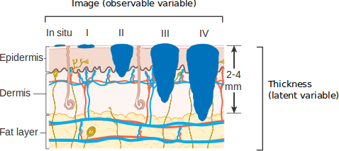

1. [Naive approaches and decomposition methods in orca](#naive-approaches-and-decomposition-methods-in-orca)
	1. [Loading the dataset and performing some preliminary experiments](#loading-the-dataset-and-performing-some-preliminary-experiments)
	2. [Naive approaches](#naive-approaches)
		1. [Regression (SVR)](#regression-svr)
		2. [Nominal classification (SVC1V1 and SVC1VA)](#nominal-classification-svc1v1-and-svc1va)
		3. [Cost sensitive classification (CSSVC)](#cost-sensitive-classification-cssvc)
		4. [Summary of results for naive approaches](#summary-of-results-for-naive-approaches)
	3. [Binary decomposition methods](#binary-decomposition-methods)
		1. [SVM with ordered partitions (SVMOP)](#svm-with-ordered-partitions-svmop)
		2. [Neural network approaches (ELMOP and NNOP)](#neural-network-approaches-elmop-and-nnop)
		3. [Summary of results for binary decompositions](#summary-of-results-for-binary-decompositions)
	4. [Ternary decomposition](#ternary-decomposition)
2. [References](#references)

# Naive approaches and decomposition methods in orca

This tutorial covers how to apply naive approaches and decomposition methods in ORCA. It is highly recommended to have previously completed the ['how to' tutorial (Notebook)](orca_tutorial_1.ipynb)/['how to' tutorial (HTML)](http://htmlpreview.github.io/?https://github.com/ayrna/orca/blob/master/doc/orca_tutorial_1.html).

We are going to test these methods using a melanoma diagnosis dataset based on dermatoscopic images. Melanoma is a type of cancer that develops from the pigment-containing cells known as melanocytes. Usually occurring on the skin, early detection and diagnosis is strongly related to survival rates. The dataset is aimed at predicting the severity of the lesion:
- A total of `100` image descriptors are used as input features, including features related to shape, colour, pigment network and texture.
- The severity is assessed in terms of melanoma thickness, measured by the Breslow index. The problem is tackled as a five-class classification problem, where the first class represents benign lesions, and the remaining four classes represent the different stages of the melanoma (0, I, II and III, where III is the thickest one and the most dangerous).


*Graphical representation of the Breslow index (source [1])*

The dataset from [1] is included in this repository, in a specific [folder](/exampledata/10-fold/melanoma-5classes-abcd-100/matlab). The corresponding script for this tutorial, ([exampleMelanoma.m](../src/code-examples/exampleMelanoma.m)), can be found and run in the [code example](../src/code-examples) folder.

## Loading the dataset and performing some preliminary experiments

First, we will load the dataset and examine the label for some of the patterns:


```octave
trainMelanoma = load('../exampledata/10-fold/melanoma-5classes-abcd-100-fs/matlab/train_melanoma-5classes-abcd-100-fs.2');
testMelanoma = load('../exampledata/10-fold/melanoma-5classes-abcd-100-fs/matlab/test_melanoma-5classes-abcd-100-fs.2');
trainMelanoma([1:5 300:305],end)
```

    ans =
    
       1
       1
       1
       1
       1
       2
       2
       2
       2
       2
       2
    


Although the data is prepared to perform a 10-fold experimental design, we are going to examine the properties of the whole set:


```octave
melanoma = [trainMelanoma; testMelanoma];
```

The dataset is quite imbalanced, as you can check with this code:


```octave
labels = {'Non-melanoma', 'In Situ', 'I', 'II', 'III-IV'};
nn = hist(melanoma(:,end),5);
bar(nn)
set (gca, 'xticklabel',labels)
```


---

***Exercise 1***: obtain the average imbalanced ratio for this dataset, where the imbalanced ratio of each class is the sum of the number of patterns of the rest of classes divided by the number of classes times the number of patterns of the class.

---
We can apply a simple method, [POM](../src/Algorithms/POM.m) [2], to check the accuracy (CCR) and MAE obtained for this dataset:


```octave
train.patterns = trainMelanoma(:,1:(end-1));
train.targets = trainMelanoma(:,end);
test.patterns = testMelanoma(:,1:(end-1));
test.targets = testMelanoma(:,end);
addpath('../src/Algorithms/');
algorithmObj = POM();
info = algorithmObj.fitpredict(train,test);
addpath('../src/Measures/');
CCR.calculateMetric(info.predictedTest,test.targets)
MAE.calculateMetric(info.predictedTest,test.targets)
```

    epsilon
     56909.29682
    ans =  0.66071
    ans =  0.51786


In the following code, we try to improve the results by considering standardization:


```octave
addpath('../src/Utils/');
[trainStandarized,testStandarized] = DataSet.standarizeData(train,test);
disp('Some patterns before standarizing')
train.patterns(1:10,2:5)
disp('The same patterns after standarizing')
trainStandarized.patterns(1:10,2:5)
```

    Some patterns before standarizing
    ans =
    
          1.39817    266.63620     68.22989     66.71459
          1.63949   1520.75100     77.41614     97.06574
          1.50760    394.50550     58.38186      0.16893
          1.27778    176.16820     83.20313      1.47513
          1.44320    552.79690     34.28749     22.74991
          1.25702     92.13424     52.84424     49.53449
          1.40287    190.13010     76.44786     91.14979
          1.59847   2333.85600     61.23107      0.00720
          1.51663    454.34930     72.21953      0.00000
          1.34062    149.19010     74.05859     77.66209
    
    The same patterns after standarizing
    ans =
    
      -0.0263804  -0.6159705   0.8400188   1.2639962
       1.1899081   0.3464767   1.3279650   2.2296928
       0.5251951  -0.5178396   0.3169205  -0.8533179
      -0.6331613  -0.6853985   1.6353530  -0.8117580
       0.2005954  -0.3963618  -0.9629005  -0.1348485
      -0.7378061  -0.7498888   0.0227789   0.7173692
      -0.0027065  -0.6746837   1.2765327   2.0414624
       0.9831587   0.9704791   0.4682625  -0.8584636
       0.5706981  -0.4719136   1.0519365  -0.8586928
      -0.3164445  -0.7061023   1.1496218   1.6123181
    


```octave
info = algorithmObj.fitpredict(trainStandarized,testStandarized);
CCR.calculateMetric(info.predictedTest,test.targets)
MAE.calculateMetric(info.predictedTest,test.targets)
```

    epsilon
     0.11250
    ans =  0.66071
    ans =  0.51786


The results have not improved in this specific case. The static method `DataSet.standarizeData(train,test)` transforms the training and test datasets and returns a copy where all the input variables have zero mean and unit standard deviation. There are other pre-processing methods in the `DataSet` class which delete constant input attributes or non numeric attributes:


```octave
[train,test] = DataSet.deleteConstantAtributes(train,test);
[train,test] = DataSet.standarizeData(train,test);
[train,test] = DataSet.deleteNonNumericValues(train,test);
info = algorithmObj.fitpredict(train,test);
CCR.calculateMetric(info.predictedTest,test.targets)
MAE.calculateMetric(info.predictedTest,test.targets)
```

    epsilon
     0.11250
    ans =  0.66071
    ans =  0.51786


Again, the results have not changed, as there were no attributes with these characteristics. However, in general, it is a good idea to apply standardisation of the input variables.

---

***Exercise 2***: construct a function (`preprocess.m`) applying these three pre-processing steps (standarisation, removal of constant features and removal of non numeric values) for future uses.

---

## Naive approaches

The first thing we will do is applying standard approaches for this ordinal regression dataset. This includes applying regression, classification and cost-sensitive classification. In this section we will use kernel methods, that are more suitable for high-dimensional data, so that we can use melanoma dataset with the full set of 100 features:


```octave
trainMelanoma = load('../exampledata/10-fold/melanoma-5classes-abcd-100/matlab/train_melanoma-5classes-abcd-100.2');
testMelanoma = load('../exampledata/10-fold/melanoma-5classes-abcd-100/matlab/test_melanoma-5classes-abcd-100.2');
train.patterns = trainMelanoma(:,1:(end-1));
train.targets = trainMelanoma(:,end);
test.patterns = testMelanoma(:,1:(end-1));
test.targets = testMelanoma(:,end);
[train,test] = DataSet.deleteConstantAtributes(train,test);
[train,test] = DataSet.standarizeData(train,test);
[train,test] = DataSet.deleteNonNumericValues(train,test);
```


### Regression (SVR)

A very simple way of solving an ordinal classification problem is to apply regression. This is, we train a regressor to predict the number of the category (where categories are coded with real consecutive values, `1`, `2`, ..., `Q`, which are scaled between 0 and 1, `0/(Q-1)=0`, `1/(Q-1)`, ..., `(Q-1)/(Q-1)`). Then, to predict categories, we round the real values predicted by the regressor to the nearest integer.

ORCA includes one algorithm following this approach based on support vector machines: [Support Vector Regression (SVR)](../src/Algorithms/SVR.m). Note that SVR considers the epsilon-SVR model with an RBF kernel, involving three different parameters:
- Parameter `C`, importance given to errors.
- Parameter `k`, inverse of the width of the RBF kernel.
- Parameter `e`, epsilon. It specifies the epsilon-tube within which no penalty is associated in the training loss function with points predicted within a distance epsilon from the actual value.

We can check the performance of this model in the melanoma dataset:


```octave
algorithmObj = SVR();
info = algorithmObj.fitpredict(train,test,struct('C',10,'k',0.001,'e',0.01));
fprintf('\nSupport Vector Regression\n---------------\n');
fprintf('SVR Accuracy: %f\n', CCR.calculateMetric(test.targets,info.predictedTest));
fprintf('SVR MAE: %f\n', MAE.calculateMetric(test.targets,info.predictedTest));

```

    
    Support Vector Regression
    ---------------
    SVR Accuracy: 0.678571
    SVR MAE: 0.392857


The object info also contains the projection values, which, in this case, are the real values without being rounded:


```octave
info.projectedTest(1:10)
```

    ans =
    
       0.109167
       0.229370
       0.028311
      -0.047946
       0.121599
       0.051311
       0.313528
       0.125686
       0.105111
       0.106238
    


As you can see, poor performance is obtained. We can try different parameter values by using a `for` loop:


```octave
fprintf('\nSupport Vector Regression parameters\n---------------\n');
bestAccuracy=0;
for C=10.^(-3:1:3)
   for k=10.^(-3:1:3)
       for e=10.^(-3:1:3)
           param = struct('C',C,'k',k,'e',e);
           info = algorithmObj.fitpredict(train,test,param);
           accuracy = CCR.calculateMetric(test.targets,info.predictedTest);
           if accuracy > bestAccuracy
               bestAccuracy = accuracy;
               bestParam = param;
           end
           fprintf('SVR C %f, k %f, e %f --> Accuracy: %f, MAE: %f\n' ...
               , C, k, e, accuracy, MAE.calculateMetric(test.targets,info.predictedTest));
       end
   end
end
fprintf('Best Results SVR C %f, k %f, e %f --> Accuracy: %f\n', bestParam.C, bestParam.k, bestParam.e, bestAccuracy);
```

    
    Support Vector Regression parameters
    ---------------
    SVR C 0.001000, k 0.001000, e 0.001000 --> Accuracy: 0.571429, MAE: 0.892857
    SVR C 0.001000, k 0.001000, e 0.010000 --> Accuracy: 0.571429, MAE: 0.892857
    SVR C 0.001000, k 0.001000, e 0.100000 --> Accuracy: 0.571429, MAE: 0.892857
    SVR C 0.001000, k 0.001000, e 1.000000 --> Accuracy: 0.178571, MAE: 1.428571
    SVR C 0.001000, k 0.001000, e 10.000000 --> Accuracy: 0.178571, MAE: 1.428571
    SVR C 0.001000, k 0.001000, e 100.000000 --> Accuracy: 0.178571, MAE: 1.428571
    SVR C 0.001000, k 0.001000, e 1000.000000 --> Accuracy: 0.178571, MAE: 1.428571
    SVR C 0.001000, k 0.010000, e 0.001000 --> Accuracy: 0.571429, MAE: 0.892857
    SVR C 0.001000, k 0.010000, e 0.010000 --> Accuracy: 0.571429, MAE: 0.892857
    SVR C 0.001000, k 0.010000, e 0.100000 --> Accuracy: 0.571429, MAE: 0.892857
    SVR C 0.001000, k 0.010000, e 1.000000 --> Accuracy: 0.178571, MAE: 1.428571
    SVR C 0.001000, k 0.010000, e 10.000000 --> Accuracy: 0.178571, MAE: 1.428571
    SVR C 0.001000, k 0.010000, e 100.000000 --> Accuracy: 0.178571, MAE: 1.428571
    SVR C 0.001000, k 0.010000, e 1000.000000 --> Accuracy: 0.178571, MAE: 1.428571
    SVR C 0.001000, k 0.100000, e 0.001000 --> Accuracy: 0.571429, MAE: 0.892857
    SVR C 0.001000, k 0.100000, e 0.010000 --> Accuracy: 0.571429, MAE: 0.892857
    SVR C 0.001000, k 0.100000, e 0.100000 --> Accuracy: 0.571429, MAE: 0.892857
    SVR C 0.001000, k 0.100000, e 1.000000 --> Accuracy: 0.178571, MAE: 1.428571
    SVR C 0.001000, k 0.100000, e 10.000000 --> Accuracy: 0.178571, MAE: 1.428571
    SVR C 0.001000, k 0.100000, e 100.000000 --> Accuracy: 0.178571, MAE: 1.428571
    SVR C 0.001000, k 0.100000, e 1000.000000 --> Accuracy: 0.178571, MAE: 1.428571
    SVR C 0.001000, k 1.000000, e 0.001000 --> Accuracy: 0.571429, MAE: 0.892857
    SVR C 0.001000, k 1.000000, e 0.010000 --> Accuracy: 0.571429, MAE: 0.892857
    SVR C 0.001000, k 1.000000, e 0.100000 --> Accuracy: 0.571429, MAE: 0.892857
    SVR C 0.001000, k 1.000000, e 1.000000 --> Accuracy: 0.178571, MAE: 1.428571
    SVR C 0.001000, k 1.000000, e 10.000000 --> Accuracy: 0.178571, MAE: 1.428571
    SVR C 0.001000, k 1.000000, e 100.000000 --> Accuracy: 0.178571, MAE: 1.428571
    SVR C 0.001000, k 1.000000, e 1000.000000 --> Accuracy: 0.178571, MAE: 1.428571
    SVR C 0.001000, k 10.000000, e 0.001000 --> Accuracy: 0.571429, MAE: 0.892857
    SVR C 0.001000, k 10.000000, e 0.010000 --> Accuracy: 0.571429, MAE: 0.892857
    SVR C 0.001000, k 10.000000, e 0.100000 --> Accuracy: 0.571429, MAE: 0.892857
    SVR C 0.001000, k 10.000000, e 1.000000 --> Accuracy: 0.178571, MAE: 1.428571
    SVR C 0.001000, k 10.000000, e 10.000000 --> Accuracy: 0.178571, MAE: 1.428571
    SVR C 0.001000, k 10.000000, e 100.000000 --> Accuracy: 0.178571, MAE: 1.428571
    SVR C 0.001000, k 10.000000, e 1000.000000 --> Accuracy: 0.178571, MAE: 1.428571
    SVR C 0.001000, k 100.000000, e 0.001000 --> Accuracy: 0.571429, MAE: 0.892857
    SVR C 0.001000, k 100.000000, e 0.010000 --> Accuracy: 0.571429, MAE: 0.892857
    SVR C 0.001000, k 100.000000, e 0.100000 --> Accuracy: 0.571429, MAE: 0.892857
    SVR C 0.001000, k 100.000000, e 1.000000 --> Accuracy: 0.178571, MAE: 1.428571
    SVR C 0.001000, k 100.000000, e 10.000000 --> Accuracy: 0.178571, MAE: 1.428571
    SVR C 0.001000, k 100.000000, e 100.000000 --> Accuracy: 0.178571, MAE: 1.428571
    SVR C 0.001000, k 100.000000, e 1000.000000 --> Accuracy: 0.178571, MAE: 1.428571
    SVR C 0.001000, k 1000.000000, e 0.001000 --> Accuracy: 0.571429, MAE: 0.892857
    SVR C 0.001000, k 1000.000000, e 0.010000 --> Accuracy: 0.571429, MAE: 0.892857
    SVR C 0.001000, k 1000.000000, e 0.100000 --> Accuracy: 0.571429, MAE: 0.892857
    SVR C 0.001000, k 1000.000000, e 1.000000 --> Accuracy: 0.178571, MAE: 1.428571
    SVR C 0.001000, k 1000.000000, e 10.000000 --> Accuracy: 0.178571, MAE: 1.428571
    SVR C 0.001000, k 1000.000000, e 100.000000 --> Accuracy: 0.178571, MAE: 1.428571
    SVR C 0.001000, k 1000.000000, e 1000.000000 --> Accuracy: 0.178571, MAE: 1.428571
    SVR C 0.010000, k 0.001000, e 0.001000 --> Accuracy: 0.571429, MAE: 0.892857
    SVR C 0.010000, k 0.001000, e 0.010000 --> Accuracy: 0.571429, MAE: 0.892857
    SVR C 0.010000, k 0.001000, e 0.100000 --> Accuracy: 0.517857, MAE: 0.732143
    SVR C 0.010000, k 0.001000, e 1.000000 --> Accuracy: 0.178571, MAE: 1.428571
    SVR C 0.010000, k 0.001000, e 10.000000 --> Accuracy: 0.178571, MAE: 1.428571
    SVR C 0.010000, k 0.001000, e 100.000000 --> Accuracy: 0.178571, MAE: 1.428571
    SVR C 0.010000, k 0.001000, e 1000.000000 --> Accuracy: 0.178571, MAE: 1.428571
    SVR C 0.010000, k 0.010000, e 0.001000 --> Accuracy: 0.607143, MAE: 0.732143
    SVR C 0.010000, k 0.010000, e 0.010000 --> Accuracy: 0.589286, MAE: 0.732143
    SVR C 0.010000, k 0.010000, e 0.100000 --> Accuracy: 0.482143, MAE: 0.732143
    SVR C 0.010000, k 0.010000, e 1.000000 --> Accuracy: 0.178571, MAE: 1.428571
    SVR C 0.010000, k 0.010000, e 10.000000 --> Accuracy: 0.178571, MAE: 1.428571
    SVR C 0.010000, k 0.010000, e 100.000000 --> Accuracy: 0.178571, MAE: 1.428571
    SVR C 0.010000, k 0.010000, e 1000.000000 --> Accuracy: 0.178571, MAE: 1.428571
    SVR C 0.010000, k 0.100000, e 0.001000 --> Accuracy: 0.571429, MAE: 0.892857
    SVR C 0.010000, k 0.100000, e 0.010000 --> Accuracy: 0.571429, MAE: 0.892857
    SVR C 0.010000, k 0.100000, e 0.100000 --> Accuracy: 0.571429, MAE: 0.892857
    SVR C 0.010000, k 0.100000, e 1.000000 --> Accuracy: 0.178571, MAE: 1.428571
    SVR C 0.010000, k 0.100000, e 10.000000 --> Accuracy: 0.178571, MAE: 1.428571
    SVR C 0.010000, k 0.100000, e 100.000000 --> Accuracy: 0.178571, MAE: 1.428571
    SVR C 0.010000, k 0.100000, e 1000.000000 --> Accuracy: 0.178571, MAE: 1.428571
    SVR C 0.010000, k 1.000000, e 0.001000 --> Accuracy: 0.571429, MAE: 0.892857
    SVR C 0.010000, k 1.000000, e 0.010000 --> Accuracy: 0.571429, MAE: 0.892857
    SVR C 0.010000, k 1.000000, e 0.100000 --> Accuracy: 0.571429, MAE: 0.892857
    SVR C 0.010000, k 1.000000, e 1.000000 --> Accuracy: 0.178571, MAE: 1.428571
    SVR C 0.010000, k 1.000000, e 10.000000 --> Accuracy: 0.178571, MAE: 1.428571
    SVR C 0.010000, k 1.000000, e 100.000000 --> Accuracy: 0.178571, MAE: 1.428571
    SVR C 0.010000, k 1.000000, e 1000.000000 --> Accuracy: 0.178571, MAE: 1.428571
    SVR C 0.010000, k 10.000000, e 0.001000 --> Accuracy: 0.571429, MAE: 0.892857
    SVR C 0.010000, k 10.000000, e 0.010000 --> Accuracy: 0.571429, MAE: 0.892857
    SVR C 0.010000, k 10.000000, e 0.100000 --> Accuracy: 0.571429, MAE: 0.892857
    SVR C 0.010000, k 10.000000, e 1.000000 --> Accuracy: 0.178571, MAE: 1.428571
    SVR C 0.010000, k 10.000000, e 10.000000 --> Accuracy: 0.178571, MAE: 1.428571
    SVR C 0.010000, k 10.000000, e 100.000000 --> Accuracy: 0.178571, MAE: 1.428571
    SVR C 0.010000, k 10.000000, e 1000.000000 --> Accuracy: 0.178571, MAE: 1.428571
    SVR C 0.010000, k 100.000000, e 0.001000 --> Accuracy: 0.571429, MAE: 0.892857
    SVR C 0.010000, k 100.000000, e 0.010000 --> Accuracy: 0.571429, MAE: 0.892857
    SVR C 0.010000, k 100.000000, e 0.100000 --> Accuracy: 0.571429, MAE: 0.892857
    SVR C 0.010000, k 100.000000, e 1.000000 --> Accuracy: 0.178571, MAE: 1.428571
    SVR C 0.010000, k 100.000000, e 10.000000 --> Accuracy: 0.178571, MAE: 1.428571
    SVR C 0.010000, k 100.000000, e 100.000000 --> Accuracy: 0.178571, MAE: 1.428571
    SVR C 0.010000, k 100.000000, e 1000.000000 --> Accuracy: 0.178571, MAE: 1.428571
    SVR C 0.010000, k 1000.000000, e 0.001000 --> Accuracy: 0.571429, MAE: 0.892857
    SVR C 0.010000, k 1000.000000, e 0.010000 --> Accuracy: 0.571429, MAE: 0.892857
    SVR C 0.010000, k 1000.000000, e 0.100000 --> Accuracy: 0.571429, MAE: 0.892857
    SVR C 0.010000, k 1000.000000, e 1.000000 --> Accuracy: 0.178571, MAE: 1.428571
    SVR C 0.010000, k 1000.000000, e 10.000000 --> Accuracy: 0.178571, MAE: 1.428571
    SVR C 0.010000, k 1000.000000, e 100.000000 --> Accuracy: 0.178571, MAE: 1.428571
    SVR C 0.010000, k 1000.000000, e 1000.000000 --> Accuracy: 0.178571, MAE: 1.428571
    SVR C 0.100000, k 0.001000, e 0.001000 --> Accuracy: 0.517857, MAE: 0.642857
    SVR C 0.100000, k 0.001000, e 0.010000 --> Accuracy: 0.517857, MAE: 0.660714
    SVR C 0.100000, k 0.001000, e 0.100000 --> Accuracy: 0.464286, MAE: 0.660714
    SVR C 0.100000, k 0.001000, e 1.000000 --> Accuracy: 0.178571, MAE: 1.428571
    SVR C 0.100000, k 0.001000, e 10.000000 --> Accuracy: 0.178571, MAE: 1.428571
    SVR C 0.100000, k 0.001000, e 100.000000 --> Accuracy: 0.178571, MAE: 1.428571
    SVR C 0.100000, k 0.001000, e 1000.000000 --> Accuracy: 0.178571, MAE: 1.428571
    SVR C 0.100000, k 0.010000, e 0.001000 --> Accuracy: 0.553571, MAE: 0.571429
    SVR C 0.100000, k 0.010000, e 0.010000 --> Accuracy: 0.535714, MAE: 0.589286
    SVR C 0.100000, k 0.010000, e 0.100000 --> Accuracy: 0.517857, MAE: 0.571429
    SVR C 0.100000, k 0.010000, e 1.000000 --> Accuracy: 0.178571, MAE: 1.428571
    SVR C 0.100000, k 0.010000, e 10.000000 --> Accuracy: 0.178571, MAE: 1.428571
    SVR C 0.100000, k 0.010000, e 100.000000 --> Accuracy: 0.178571, MAE: 1.428571
    SVR C 0.100000, k 0.010000, e 1000.000000 --> Accuracy: 0.178571, MAE: 1.428571
    SVR C 0.100000, k 0.100000, e 0.001000 --> Accuracy: 0.571429, MAE: 0.875000
    SVR C 0.100000, k 0.100000, e 0.010000 --> Accuracy: 0.553571, MAE: 0.857143
    SVR C 0.100000, k 0.100000, e 0.100000 --> Accuracy: 0.107143, MAE: 1.053571
    SVR C 0.100000, k 0.100000, e 1.000000 --> Accuracy: 0.178571, MAE: 1.428571
    SVR C 0.100000, k 0.100000, e 10.000000 --> Accuracy: 0.178571, MAE: 1.428571
    SVR C 0.100000, k 0.100000, e 100.000000 --> Accuracy: 0.178571, MAE: 1.428571
    SVR C 0.100000, k 0.100000, e 1000.000000 --> Accuracy: 0.178571, MAE: 1.428571
    SVR C 0.100000, k 1.000000, e 0.001000 --> Accuracy: 0.571429, MAE: 0.892857
    SVR C 0.100000, k 1.000000, e 0.010000 --> Accuracy: 0.571429, MAE: 0.892857
    SVR C 0.100000, k 1.000000, e 0.100000 --> Accuracy: 0.125000, MAE: 1.035714
    SVR C 0.100000, k 1.000000, e 1.000000 --> Accuracy: 0.178571, MAE: 1.428571
    SVR C 0.100000, k 1.000000, e 10.000000 --> Accuracy: 0.178571, MAE: 1.428571
    SVR C 0.100000, k 1.000000, e 100.000000 --> Accuracy: 0.178571, MAE: 1.428571
    SVR C 0.100000, k 1.000000, e 1000.000000 --> Accuracy: 0.178571, MAE: 1.428571
    SVR C 0.100000, k 10.000000, e 0.001000 --> Accuracy: 0.571429, MAE: 0.892857
    SVR C 0.100000, k 10.000000, e 0.010000 --> Accuracy: 0.571429, MAE: 0.892857
    SVR C 0.100000, k 10.000000, e 0.100000 --> Accuracy: 0.125000, MAE: 1.035714
    SVR C 0.100000, k 10.000000, e 1.000000 --> Accuracy: 0.178571, MAE: 1.428571
    SVR C 0.100000, k 10.000000, e 10.000000 --> Accuracy: 0.178571, MAE: 1.428571
    SVR C 0.100000, k 10.000000, e 100.000000 --> Accuracy: 0.178571, MAE: 1.428571
    SVR C 0.100000, k 10.000000, e 1000.000000 --> Accuracy: 0.178571, MAE: 1.428571
    SVR C 0.100000, k 100.000000, e 0.001000 --> Accuracy: 0.571429, MAE: 0.892857
    SVR C 0.100000, k 100.000000, e 0.010000 --> Accuracy: 0.571429, MAE: 0.892857
    SVR C 0.100000, k 100.000000, e 0.100000 --> Accuracy: 0.125000, MAE: 1.035714
    SVR C 0.100000, k 100.000000, e 1.000000 --> Accuracy: 0.178571, MAE: 1.428571
    SVR C 0.100000, k 100.000000, e 10.000000 --> Accuracy: 0.178571, MAE: 1.428571
    SVR C 0.100000, k 100.000000, e 100.000000 --> Accuracy: 0.178571, MAE: 1.428571
    SVR C 0.100000, k 100.000000, e 1000.000000 --> Accuracy: 0.178571, MAE: 1.428571
    SVR C 0.100000, k 1000.000000, e 0.001000 --> Accuracy: 0.571429, MAE: 0.892857
    SVR C 0.100000, k 1000.000000, e 0.010000 --> Accuracy: 0.571429, MAE: 0.892857
    SVR C 0.100000, k 1000.000000, e 0.100000 --> Accuracy: 0.125000, MAE: 1.035714
    SVR C 0.100000, k 1000.000000, e 1.000000 --> Accuracy: 0.178571, MAE: 1.428571
    SVR C 0.100000, k 1000.000000, e 10.000000 --> Accuracy: 0.178571, MAE: 1.428571
    SVR C 0.100000, k 1000.000000, e 100.000000 --> Accuracy: 0.178571, MAE: 1.428571
    SVR C 0.100000, k 1000.000000, e 1000.000000 --> Accuracy: 0.178571, MAE: 1.428571
    SVR C 1.000000, k 0.001000, e 0.001000 --> Accuracy: 0.625000, MAE: 0.482143
    SVR C 1.000000, k 0.001000, e 0.010000 --> Accuracy: 0.589286, MAE: 0.517857
    SVR C 1.000000, k 0.001000, e 0.100000 --> Accuracy: 0.589286, MAE: 0.482143
    SVR C 1.000000, k 0.001000, e 1.000000 --> Accuracy: 0.178571, MAE: 1.428571
    SVR C 1.000000, k 0.001000, e 10.000000 --> Accuracy: 0.178571, MAE: 1.428571
    SVR C 1.000000, k 0.001000, e 100.000000 --> Accuracy: 0.178571, MAE: 1.428571
    SVR C 1.000000, k 0.001000, e 1000.000000 --> Accuracy: 0.178571, MAE: 1.428571
    SVR C 1.000000, k 0.010000, e 0.001000 --> Accuracy: 0.535714, MAE: 0.535714
    SVR C 1.000000, k 0.010000, e 0.010000 --> Accuracy: 0.535714, MAE: 0.553571
    SVR C 1.000000, k 0.010000, e 0.100000 --> Accuracy: 0.500000, MAE: 0.589286
    SVR C 1.000000, k 0.010000, e 1.000000 --> Accuracy: 0.178571, MAE: 1.428571
    SVR C 1.000000, k 0.010000, e 10.000000 --> Accuracy: 0.178571, MAE: 1.428571
    SVR C 1.000000, k 0.010000, e 100.000000 --> Accuracy: 0.178571, MAE: 1.428571
    SVR C 1.000000, k 0.010000, e 1000.000000 --> Accuracy: 0.178571, MAE: 1.428571
    SVR C 1.000000, k 0.100000, e 0.001000 --> Accuracy: 0.142857, MAE: 1.035714
    SVR C 1.000000, k 0.100000, e 0.010000 --> Accuracy: 0.142857, MAE: 1.035714
    SVR C 1.000000, k 0.100000, e 0.100000 --> Accuracy: 0.142857, MAE: 1.035714
    SVR C 1.000000, k 0.100000, e 1.000000 --> Accuracy: 0.178571, MAE: 1.428571
    SVR C 1.000000, k 0.100000, e 10.000000 --> Accuracy: 0.178571, MAE: 1.428571
    SVR C 1.000000, k 0.100000, e 100.000000 --> Accuracy: 0.178571, MAE: 1.428571
    SVR C 1.000000, k 0.100000, e 1000.000000 --> Accuracy: 0.178571, MAE: 1.428571
    SVR C 1.000000, k 1.000000, e 0.001000 --> Accuracy: 0.125000, MAE: 1.035714
    SVR C 1.000000, k 1.000000, e 0.010000 --> Accuracy: 0.125000, MAE: 1.035714
    SVR C 1.000000, k 1.000000, e 0.100000 --> Accuracy: 0.125000, MAE: 1.035714
    SVR C 1.000000, k 1.000000, e 1.000000 --> Accuracy: 0.178571, MAE: 1.428571
    SVR C 1.000000, k 1.000000, e 10.000000 --> Accuracy: 0.178571, MAE: 1.428571
    SVR C 1.000000, k 1.000000, e 100.000000 --> Accuracy: 0.178571, MAE: 1.428571
    SVR C 1.000000, k 1.000000, e 1000.000000 --> Accuracy: 0.178571, MAE: 1.428571
    SVR C 1.000000, k 10.000000, e 0.001000 --> Accuracy: 0.125000, MAE: 1.035714
    SVR C 1.000000, k 10.000000, e 0.010000 --> Accuracy: 0.125000, MAE: 1.035714
    SVR C 1.000000, k 10.000000, e 0.100000 --> Accuracy: 0.125000, MAE: 1.035714
    SVR C 1.000000, k 10.000000, e 1.000000 --> Accuracy: 0.178571, MAE: 1.428571
    SVR C 1.000000, k 10.000000, e 10.000000 --> Accuracy: 0.178571, MAE: 1.428571
    SVR C 1.000000, k 10.000000, e 100.000000 --> Accuracy: 0.178571, MAE: 1.428571
    SVR C 1.000000, k 10.000000, e 1000.000000 --> Accuracy: 0.178571, MAE: 1.428571
    SVR C 1.000000, k 100.000000, e 0.001000 --> Accuracy: 0.125000, MAE: 1.035714
    SVR C 1.000000, k 100.000000, e 0.010000 --> Accuracy: 0.125000, MAE: 1.035714
    SVR C 1.000000, k 100.000000, e 0.100000 --> Accuracy: 0.125000, MAE: 1.035714
    SVR C 1.000000, k 100.000000, e 1.000000 --> Accuracy: 0.178571, MAE: 1.428571
    SVR C 1.000000, k 100.000000, e 10.000000 --> Accuracy: 0.178571, MAE: 1.428571
    SVR C 1.000000, k 100.000000, e 100.000000 --> Accuracy: 0.178571, MAE: 1.428571
    SVR C 1.000000, k 100.000000, e 1000.000000 --> Accuracy: 0.178571, MAE: 1.428571
    SVR C 1.000000, k 1000.000000, e 0.001000 --> Accuracy: 0.125000, MAE: 1.035714
    SVR C 1.000000, k 1000.000000, e 0.010000 --> Accuracy: 0.125000, MAE: 1.035714
    SVR C 1.000000, k 1000.000000, e 0.100000 --> Accuracy: 0.125000, MAE: 1.035714
    SVR C 1.000000, k 1000.000000, e 1.000000 --> Accuracy: 0.178571, MAE: 1.428571
    SVR C 1.000000, k 1000.000000, e 10.000000 --> Accuracy: 0.178571, MAE: 1.428571
    SVR C 1.000000, k 1000.000000, e 100.000000 --> Accuracy: 0.178571, MAE: 1.428571
    SVR C 1.000000, k 1000.000000, e 1000.000000 --> Accuracy: 0.178571, MAE: 1.428571
    SVR C 10.000000, k 0.001000, e 0.001000 --> Accuracy: 0.660714, MAE: 0.410714
    SVR C 10.000000, k 0.001000, e 0.010000 --> Accuracy: 0.678571, MAE: 0.392857
    SVR C 10.000000, k 0.001000, e 0.100000 --> Accuracy: 0.678571, MAE: 0.375000
    SVR C 10.000000, k 0.001000, e 1.000000 --> Accuracy: 0.178571, MAE: 1.428571
    SVR C 10.000000, k 0.001000, e 10.000000 --> Accuracy: 0.178571, MAE: 1.428571
    SVR C 10.000000, k 0.001000, e 100.000000 --> Accuracy: 0.178571, MAE: 1.428571
    SVR C 10.000000, k 0.001000, e 1000.000000 --> Accuracy: 0.178571, MAE: 1.428571
    SVR C 10.000000, k 0.010000, e 0.001000 --> Accuracy: 0.535714, MAE: 0.589286
    SVR C 10.000000, k 0.010000, e 0.010000 --> Accuracy: 0.535714, MAE: 0.589286
    SVR C 10.000000, k 0.010000, e 0.100000 --> Accuracy: 0.500000, MAE: 0.625000
    SVR C 10.000000, k 0.010000, e 1.000000 --> Accuracy: 0.178571, MAE: 1.428571
    SVR C 10.000000, k 0.010000, e 10.000000 --> Accuracy: 0.178571, MAE: 1.428571
    SVR C 10.000000, k 0.010000, e 100.000000 --> Accuracy: 0.178571, MAE: 1.428571
    SVR C 10.000000, k 0.010000, e 1000.000000 --> Accuracy: 0.178571, MAE: 1.428571
    SVR C 10.000000, k 0.100000, e 0.001000 --> Accuracy: 0.142857, MAE: 1.035714
    SVR C 10.000000, k 0.100000, e 0.010000 --> Accuracy: 0.142857, MAE: 1.035714
    SVR C 10.000000, k 0.100000, e 0.100000 --> Accuracy: 0.142857, MAE: 1.035714
    SVR C 10.000000, k 0.100000, e 1.000000 --> Accuracy: 0.178571, MAE: 1.428571
    SVR C 10.000000, k 0.100000, e 10.000000 --> Accuracy: 0.178571, MAE: 1.428571
    SVR C 10.000000, k 0.100000, e 100.000000 --> Accuracy: 0.178571, MAE: 1.428571
    SVR C 10.000000, k 0.100000, e 1000.000000 --> Accuracy: 0.178571, MAE: 1.428571
    SVR C 10.000000, k 1.000000, e 0.001000 --> Accuracy: 0.125000, MAE: 1.035714
    SVR C 10.000000, k 1.000000, e 0.010000 --> Accuracy: 0.125000, MAE: 1.035714
    SVR C 10.000000, k 1.000000, e 0.100000 --> Accuracy: 0.125000, MAE: 1.035714
    SVR C 10.000000, k 1.000000, e 1.000000 --> Accuracy: 0.178571, MAE: 1.428571
    SVR C 10.000000, k 1.000000, e 10.000000 --> Accuracy: 0.178571, MAE: 1.428571
    SVR C 10.000000, k 1.000000, e 100.000000 --> Accuracy: 0.178571, MAE: 1.428571
    SVR C 10.000000, k 1.000000, e 1000.000000 --> Accuracy: 0.178571, MAE: 1.428571
    SVR C 10.000000, k 10.000000, e 0.001000 --> Accuracy: 0.125000, MAE: 1.035714
    SVR C 10.000000, k 10.000000, e 0.010000 --> Accuracy: 0.125000, MAE: 1.035714
    SVR C 10.000000, k 10.000000, e 0.100000 --> Accuracy: 0.125000, MAE: 1.035714
    SVR C 10.000000, k 10.000000, e 1.000000 --> Accuracy: 0.178571, MAE: 1.428571
    SVR C 10.000000, k 10.000000, e 10.000000 --> Accuracy: 0.178571, MAE: 1.428571
    SVR C 10.000000, k 10.000000, e 100.000000 --> Accuracy: 0.178571, MAE: 1.428571
    SVR C 10.000000, k 10.000000, e 1000.000000 --> Accuracy: 0.178571, MAE: 1.428571
    SVR C 10.000000, k 100.000000, e 0.001000 --> Accuracy: 0.125000, MAE: 1.035714
    SVR C 10.000000, k 100.000000, e 0.010000 --> Accuracy: 0.125000, MAE: 1.035714
    SVR C 10.000000, k 100.000000, e 0.100000 --> Accuracy: 0.125000, MAE: 1.035714
    SVR C 10.000000, k 100.000000, e 1.000000 --> Accuracy: 0.178571, MAE: 1.428571
    SVR C 10.000000, k 100.000000, e 10.000000 --> Accuracy: 0.178571, MAE: 1.428571
    SVR C 10.000000, k 100.000000, e 100.000000 --> Accuracy: 0.178571, MAE: 1.428571
    SVR C 10.000000, k 100.000000, e 1000.000000 --> Accuracy: 0.178571, MAE: 1.428571
    SVR C 10.000000, k 1000.000000, e 0.001000 --> Accuracy: 0.125000, MAE: 1.035714
    SVR C 10.000000, k 1000.000000, e 0.010000 --> Accuracy: 0.125000, MAE: 1.035714
    SVR C 10.000000, k 1000.000000, e 0.100000 --> Accuracy: 0.125000, MAE: 1.035714
    SVR C 10.000000, k 1000.000000, e 1.000000 --> Accuracy: 0.178571, MAE: 1.428571
    SVR C 10.000000, k 1000.000000, e 10.000000 --> Accuracy: 0.178571, MAE: 1.428571
    SVR C 10.000000, k 1000.000000, e 100.000000 --> Accuracy: 0.178571, MAE: 1.428571
    SVR C 10.000000, k 1000.000000, e 1000.000000 --> Accuracy: 0.178571, MAE: 1.428571
    SVR C 100.000000, k 0.001000, e 0.001000 --> Accuracy: 0.607143, MAE: 0.428571
    SVR C 100.000000, k 0.001000, e 0.010000 --> Accuracy: 0.625000, MAE: 0.410714
    SVR C 100.000000, k 0.001000, e 0.100000 --> Accuracy: 0.535714, MAE: 0.535714
    SVR C 100.000000, k 0.001000, e 1.000000 --> Accuracy: 0.178571, MAE: 1.428571
    SVR C 100.000000, k 0.001000, e 10.000000 --> Accuracy: 0.178571, MAE: 1.428571
    SVR C 100.000000, k 0.001000, e 100.000000 --> Accuracy: 0.178571, MAE: 1.428571
    SVR C 100.000000, k 0.001000, e 1000.000000 --> Accuracy: 0.178571, MAE: 1.428571
    SVR C 100.000000, k 0.010000, e 0.001000 --> Accuracy: 0.571429, MAE: 0.589286
    SVR C 100.000000, k 0.010000, e 0.010000 --> Accuracy: 0.535714, MAE: 0.607143
    SVR C 100.000000, k 0.010000, e 0.100000 --> Accuracy: 0.517857, MAE: 0.625000
    SVR C 100.000000, k 0.010000, e 1.000000 --> Accuracy: 0.178571, MAE: 1.428571
    SVR C 100.000000, k 0.010000, e 10.000000 --> Accuracy: 0.178571, MAE: 1.428571
    SVR C 100.000000, k 0.010000, e 100.000000 --> Accuracy: 0.178571, MAE: 1.428571
    SVR C 100.000000, k 0.010000, e 1000.000000 --> Accuracy: 0.178571, MAE: 1.428571
    SVR C 100.000000, k 0.100000, e 0.001000 --> Accuracy: 0.142857, MAE: 1.035714
    SVR C 100.000000, k 0.100000, e 0.010000 --> Accuracy: 0.142857, MAE: 1.035714
    SVR C 100.000000, k 0.100000, e 0.100000 --> Accuracy: 0.142857, MAE: 1.035714
    SVR C 100.000000, k 0.100000, e 1.000000 --> Accuracy: 0.178571, MAE: 1.428571
    SVR C 100.000000, k 0.100000, e 10.000000 --> Accuracy: 0.178571, MAE: 1.428571
    SVR C 100.000000, k 0.100000, e 100.000000 --> Accuracy: 0.178571, MAE: 1.428571
    SVR C 100.000000, k 0.100000, e 1000.000000 --> Accuracy: 0.178571, MAE: 1.428571
    SVR C 100.000000, k 1.000000, e 0.001000 --> Accuracy: 0.125000, MAE: 1.035714
    SVR C 100.000000, k 1.000000, e 0.010000 --> Accuracy: 0.125000, MAE: 1.035714
    SVR C 100.000000, k 1.000000, e 0.100000 --> Accuracy: 0.125000, MAE: 1.035714
    SVR C 100.000000, k 1.000000, e 1.000000 --> Accuracy: 0.178571, MAE: 1.428571
    SVR C 100.000000, k 1.000000, e 10.000000 --> Accuracy: 0.178571, MAE: 1.428571
    SVR C 100.000000, k 1.000000, e 100.000000 --> Accuracy: 0.178571, MAE: 1.428571
    SVR C 100.000000, k 1.000000, e 1000.000000 --> Accuracy: 0.178571, MAE: 1.428571
    SVR C 100.000000, k 10.000000, e 0.001000 --> Accuracy: 0.125000, MAE: 1.035714
    SVR C 100.000000, k 10.000000, e 0.010000 --> Accuracy: 0.125000, MAE: 1.035714
    SVR C 100.000000, k 10.000000, e 0.100000 --> Accuracy: 0.125000, MAE: 1.035714
    SVR C 100.000000, k 10.000000, e 1.000000 --> Accuracy: 0.178571, MAE: 1.428571
    SVR C 100.000000, k 10.000000, e 10.000000 --> Accuracy: 0.178571, MAE: 1.428571
    SVR C 100.000000, k 10.000000, e 100.000000 --> Accuracy: 0.178571, MAE: 1.428571
    SVR C 100.000000, k 10.000000, e 1000.000000 --> Accuracy: 0.178571, MAE: 1.428571
    SVR C 100.000000, k 100.000000, e 0.001000 --> Accuracy: 0.125000, MAE: 1.035714
    SVR C 100.000000, k 100.000000, e 0.010000 --> Accuracy: 0.125000, MAE: 1.035714
    SVR C 100.000000, k 100.000000, e 0.100000 --> Accuracy: 0.125000, MAE: 1.035714
    SVR C 100.000000, k 100.000000, e 1.000000 --> Accuracy: 0.178571, MAE: 1.428571
    SVR C 100.000000, k 100.000000, e 10.000000 --> Accuracy: 0.178571, MAE: 1.428571
    SVR C 100.000000, k 100.000000, e 100.000000 --> Accuracy: 0.178571, MAE: 1.428571
    SVR C 100.000000, k 100.000000, e 1000.000000 --> Accuracy: 0.178571, MAE: 1.428571
    SVR C 100.000000, k 1000.000000, e 0.001000 --> Accuracy: 0.125000, MAE: 1.035714
    SVR C 100.000000, k 1000.000000, e 0.010000 --> Accuracy: 0.125000, MAE: 1.035714
    SVR C 100.000000, k 1000.000000, e 0.100000 --> Accuracy: 0.125000, MAE: 1.035714
    SVR C 100.000000, k 1000.000000, e 1.000000 --> Accuracy: 0.178571, MAE: 1.428571
    SVR C 100.000000, k 1000.000000, e 10.000000 --> Accuracy: 0.178571, MAE: 1.428571
    SVR C 100.000000, k 1000.000000, e 100.000000 --> Accuracy: 0.178571, MAE: 1.428571
    SVR C 100.000000, k 1000.000000, e 1000.000000 --> Accuracy: 0.178571, MAE: 1.428571
    SVR C 1000.000000, k 0.001000, e 0.001000 --> Accuracy: 0.607143, MAE: 0.500000
    SVR C 1000.000000, k 0.001000, e 0.010000 --> Accuracy: 0.589286, MAE: 0.517857
    SVR C 1000.000000, k 0.001000, e 0.100000 --> Accuracy: 0.571429, MAE: 0.553571
    SVR C 1000.000000, k 0.001000, e 1.000000 --> Accuracy: 0.178571, MAE: 1.428571
    SVR C 1000.000000, k 0.001000, e 10.000000 --> Accuracy: 0.178571, MAE: 1.428571
    SVR C 1000.000000, k 0.001000, e 100.000000 --> Accuracy: 0.178571, MAE: 1.428571
    SVR C 1000.000000, k 0.001000, e 1000.000000 --> Accuracy: 0.178571, MAE: 1.428571
    SVR C 1000.000000, k 0.010000, e 0.001000 --> Accuracy: 0.571429, MAE: 0.589286
    SVR C 1000.000000, k 0.010000, e 0.010000 --> Accuracy: 0.535714, MAE: 0.607143
    SVR C 1000.000000, k 0.010000, e 0.100000 --> Accuracy: 0.517857, MAE: 0.625000
    SVR C 1000.000000, k 0.010000, e 1.000000 --> Accuracy: 0.178571, MAE: 1.428571
    SVR C 1000.000000, k 0.010000, e 10.000000 --> Accuracy: 0.178571, MAE: 1.428571
    SVR C 1000.000000, k 0.010000, e 100.000000 --> Accuracy: 0.178571, MAE: 1.428571
    SVR C 1000.000000, k 0.010000, e 1000.000000 --> Accuracy: 0.178571, MAE: 1.428571
    SVR C 1000.000000, k 0.100000, e 0.001000 --> Accuracy: 0.142857, MAE: 1.035714
    SVR C 1000.000000, k 0.100000, e 0.010000 --> Accuracy: 0.142857, MAE: 1.035714
    SVR C 1000.000000, k 0.100000, e 0.100000 --> Accuracy: 0.142857, MAE: 1.035714
    SVR C 1000.000000, k 0.100000, e 1.000000 --> Accuracy: 0.178571, MAE: 1.428571
    SVR C 1000.000000, k 0.100000, e 10.000000 --> Accuracy: 0.178571, MAE: 1.428571
    SVR C 1000.000000, k 0.100000, e 100.000000 --> Accuracy: 0.178571, MAE: 1.428571
    SVR C 1000.000000, k 0.100000, e 1000.000000 --> Accuracy: 0.178571, MAE: 1.428571
    SVR C 1000.000000, k 1.000000, e 0.001000 --> Accuracy: 0.125000, MAE: 1.035714
    SVR C 1000.000000, k 1.000000, e 0.010000 --> Accuracy: 0.125000, MAE: 1.035714
    SVR C 1000.000000, k 1.000000, e 0.100000 --> Accuracy: 0.125000, MAE: 1.035714
    SVR C 1000.000000, k 1.000000, e 1.000000 --> Accuracy: 0.178571, MAE: 1.428571
    SVR C 1000.000000, k 1.000000, e 10.000000 --> Accuracy: 0.178571, MAE: 1.428571
    SVR C 1000.000000, k 1.000000, e 100.000000 --> Accuracy: 0.178571, MAE: 1.428571
    SVR C 1000.000000, k 1.000000, e 1000.000000 --> Accuracy: 0.178571, MAE: 1.428571
    SVR C 1000.000000, k 10.000000, e 0.001000 --> Accuracy: 0.125000, MAE: 1.035714
    SVR C 1000.000000, k 10.000000, e 0.010000 --> Accuracy: 0.125000, MAE: 1.035714
    SVR C 1000.000000, k 10.000000, e 0.100000 --> Accuracy: 0.125000, MAE: 1.035714
    SVR C 1000.000000, k 10.000000, e 1.000000 --> Accuracy: 0.178571, MAE: 1.428571
    SVR C 1000.000000, k 10.000000, e 10.000000 --> Accuracy: 0.178571, MAE: 1.428571
    SVR C 1000.000000, k 10.000000, e 100.000000 --> Accuracy: 0.178571, MAE: 1.428571
    SVR C 1000.000000, k 10.000000, e 1000.000000 --> Accuracy: 0.178571, MAE: 1.428571
    SVR C 1000.000000, k 100.000000, e 0.001000 --> Accuracy: 0.125000, MAE: 1.035714
    SVR C 1000.000000, k 100.000000, e 0.010000 --> Accuracy: 0.125000, MAE: 1.035714
    SVR C 1000.000000, k 100.000000, e 0.100000 --> Accuracy: 0.125000, MAE: 1.035714
    SVR C 1000.000000, k 100.000000, e 1.000000 --> Accuracy: 0.178571, MAE: 1.428571
    SVR C 1000.000000, k 100.000000, e 10.000000 --> Accuracy: 0.178571, MAE: 1.428571
    SVR C 1000.000000, k 100.000000, e 100.000000 --> Accuracy: 0.178571, MAE: 1.428571
    SVR C 1000.000000, k 100.000000, e 1000.000000 --> Accuracy: 0.178571, MAE: 1.428571
    SVR C 1000.000000, k 1000.000000, e 0.001000 --> Accuracy: 0.125000, MAE: 1.035714
    SVR C 1000.000000, k 1000.000000, e 0.010000 --> Accuracy: 0.125000, MAE: 1.035714
    SVR C 1000.000000, k 1000.000000, e 0.100000 --> Accuracy: 0.125000, MAE: 1.035714
    SVR C 1000.000000, k 1000.000000, e 1.000000 --> Accuracy: 0.178571, MAE: 1.428571
    SVR C 1000.000000, k 1000.000000, e 10.000000 --> Accuracy: 0.178571, MAE: 1.428571
    SVR C 1000.000000, k 1000.000000, e 100.000000 --> Accuracy: 0.178571, MAE: 1.428571
    SVR C 1000.000000, k 1000.000000, e 1000.000000 --> Accuracy: 0.178571, MAE: 1.428571
    Best Results SVR C 10.000000, k 0.001000, e 0.010000 --> Accuracy: 0.678571


As you can check, the best configuration leads to almost a 70% of accuracy, which is not very bad considering that we have 5 classes.

This way of adjusting the parameters is not fair, as we can be overfitting the test set. The decision of the optimal parameters should be taken without checking test results. This can be done by using nested crossvalidation.

---

***Exercise 3*** : complete the code of the script ([crossvalide.m](tutorial/scripts/crossvalide.m)) for automatising hyper-parameter selection in this problem. The idea is to have a function like this:
``` MATLAB
>> param = crossvalide(algorithmObj,train,5);
>> param

param =

    C: 0.0100
    k: 0.0100
    e: 0.0100
>> fprintf('\nSupport Vector Regression with cross validated parameters\n---------------\n');
fprintf('SVR Accuracy: %f\n', CCR.calculateMetric(test.targets,info.predictedTest));
fprintf('SVR MAE: %f\n', MAE.calculateMetric(test.targets,info.predictedTest));

Support Vector Regression with cross validated parameters
---------------
SVR Accuracy: 0.589286
SVR MAE: 0.732143
```
Although the results are worse, we can be sure that here there is no overfitting.

---

Fortunately, this can be easily done in ORCA by using the `ini` files with the correct format. [svrMelanoma.ini](tutorial/config-files/svrMelanoma.ini) is a configuration file with the following contents:
```ini
;SVR experiments for melanoma
;
; Experiment ID
[svr-mae-tutorial-melanoma]
{general-conf}
seed = 1
; Datasets path
basedir = ../exampledata/10-fold
; Datasets to process (comma separated list or all to process all)
datasets = melanoma-5classes-abcd-100
; Activate data standardization
standarize = true
; Number of folds for the parameters optimization
num_folds = 5
; Crossvalidation metric
cvmetric = ccr

; Method: algorithm and parameter
{algorithm-parameters}
algorithm = SVR
;kernelType = rbf

; Method's hyper-parameter values to optimize
{algorithm-hyper-parameters-to-cv}
C = 10.^(-2:1:2)
k = 10.^(-2:1:2)
e = 10.^(-3:1:0)
```
In this way, we will obtain the results for the 10 partitions. This `ini` file can be run by using the following code (to be run from the `doc` folder):


```octave
Utilities.runExperiments('tutorial/config-files/svrMelanomafs.ini')
```

    warning: addpath: /home/pedroa/orca/src/Utils/Measures: No such file or directory
    warning: called from
        runExperiments at line 55 column 13
    warning: addpath: /home/pedroa/orca/src/Utils/Algorithms: No such file or directory
    warning: called from
        runExperiments at line 56 column 13
    Setting up experiments...
    Running experiment exp-svr-mae-tutorial-melanoma-melanoma-5classes-abcd-100-fs-1.ini
    Running experiment exp-svr-mae-tutorial-melanoma-melanoma-5classes-abcd-100-fs-10.ini
    Running experiment exp-svr-mae-tutorial-melanoma-melanoma-5classes-abcd-100-fs-2.ini
    Running experiment exp-svr-mae-tutorial-melanoma-melanoma-5classes-abcd-100-fs-3.ini
    Running experiment exp-svr-mae-tutorial-melanoma-melanoma-5classes-abcd-100-fs-4.ini
    Running experiment exp-svr-mae-tutorial-melanoma-melanoma-5classes-abcd-100-fs-5.ini
    Running experiment exp-svr-mae-tutorial-melanoma-melanoma-5classes-abcd-100-fs-6.ini
    Running experiment exp-svr-mae-tutorial-melanoma-melanoma-5classes-abcd-100-fs-7.ini
    Running experiment exp-svr-mae-tutorial-melanoma-melanoma-5classes-abcd-100-fs-8.ini
    Running experiment exp-svr-mae-tutorial-melanoma-melanoma-5classes-abcd-100-fs-9.ini
    Calculating results...
    warning: addpath: /home/pedroa/orca/src/Utils/Measures: No such file or directory
    warning: called from
        results at line 141 column 13
        runExperiments at line 98 column 13
    warning: addpath: /home/pedroa/orca/src/Utils/Algorithms: No such file or directory
    warning: called from
        results at line 142 column 13
        runExperiments at line 98 column 13
    Experiments/exp-2019-5-6-18-38-20/Results/melanoma-5classes-abcd-100-fs-svr-mae-tutorial-melanoma/dataset
    warning: rmpath: /home/pedroa/orca/src/Utils/Measures: not found
    warning: called from
        results at line 380 column 13
        runExperiments at line 98 column 13
    warning: rmpath: /home/pedroa/orca/src/Utils/Algorithms: not found
    warning: called from
        results at line 381 column 13
        runExperiments at line 98 column 13
    warning: addpath: /home/pedroa/orca/src/Utils/Measures: No such file or directory
    warning: called from
        results at line 141 column 13
        runExperiments at line 100 column 13
    warning: addpath: /home/pedroa/orca/src/Utils/Algorithms: No such file or directory
    warning: called from
        results at line 142 column 13
        runExperiments at line 100 column 13
    Experiments/exp-2019-5-6-18-38-20/Results/melanoma-5classes-abcd-100-fs-svr-mae-tutorial-melanoma/dataset
    warning: rmpath: /home/pedroa/orca/src/Utils/Measures: not found
    warning: called from
        results at line 380 column 13
        runExperiments at line 100 column 13
    warning: rmpath: /home/pedroa/orca/src/Utils/Algorithms: not found
    warning: called from
        results at line 381 column 13
        runExperiments at line 100 column 13
    ans = Experiments/exp-2019-5-6-18-38-20


Note that the number of experiments is high, so the execution can take a considerable amount of time. To accelerate the experiments you can use multiple cores of your CPU with `Utilities.runExperiments('experiments.ini','parallel', true)` (see this [page](orca_parallel.md)).

### Nominal classification (SVC1V1 and SVC1VA)

We can also approach ordinal classification by considering nominal classification, i.e. by ignoring the ordering information. It has been shown that this can make the classifier need more data to learn.

ORCA includes two approaches to perform ordinal classification by nominal classification, both based on the Support Vector Classifier:
- [One-Vs-One (SVC1V1)](../src/Algorithms/SVC1V1.m) [3], where all pairs of classes are compared in different binary SVCs. The prediction is based on majority voting.
- [One-Vs-All (SVC1VA)](../src/Algorithms/SVC1VA.m) [3], where each class is compared against the rest. The class predicted is that with the largest decision function value.

Both methods consider an RBF kernel with the following two parameters:
- Parameter `C`, importance given to errors.
- Parameter `k`, inverse of the width of the RBF kernel.

Now, we run the SVC1V1 method:


```octave
algorithmObj = SVC1V1();
info = algorithmObj.fitpredict(train,test,struct('C',10,'k',0.001));
fprintf('\nSVC1V1\n---------------\n');
fprintf('SVC1V1 Accuracy: %f\n', CCR.calculateMetric(test.targets,info.predictedTest));
fprintf('SVC1V1 MAE: %f\n', MAE.calculateMetric(test.targets,info.predictedTest));
```

    
    SVC1V1
    ---------------
    SVC1V1 Accuracy: 0.678571
    SVC1V1 MAE: 0.517857


In SVC1V1, the decision values have `(Q(Q-1))/2` (the number of combinations of two classes from the set of `Q` possibilities) columns and majority voting is applied.


```octave
info.projectedTest(1:10,:)
```

    ans =
    
     Columns 1 through 7:
    
       0.926074   0.536692   1.024967   1.830303  -0.602659   0.984071   2.016569
       0.781432   0.482145   0.765139   0.899214  -0.519628   0.146724   1.053821
       1.528675   1.504568   1.561044   1.935776  -0.465130   0.043801   0.944491
       1.672826   2.087165   2.060144   1.702189   0.438583   2.397228   2.721777
       1.400823   1.620267   1.327972   1.661743   0.307829   0.668906   1.746674
       1.522858   1.452593   1.731991   1.742870  -0.816676  -0.359383   0.397733
       1.255397   1.143070   1.042698   1.317361  -1.144442  -0.934373  -0.192200
       1.172912   1.379507   1.437137   1.315572   0.013278   0.179874   1.168156
       0.686760   0.745882   1.214429   1.195741   0.293695   1.392134   1.054115
       0.523418   0.692412   0.706582   0.741470   0.185244   0.936942   1.564033
    
     Columns 8 through 10:
    
       1.126951   2.248576   2.797064
       0.816910   1.310837   1.206514
       0.150428   1.624378   2.462877
       1.686543   2.019641   2.294685
       0.394076   1.871991   1.857090
       0.402845   1.284394   0.931703
      -0.512859   0.916138   0.948722
       0.311567   1.752660   1.255249
       1.043376   1.083996   1.188979
       0.669801   1.071577   1.003215
    


We can also try SVC1VA:


```octave
algorithmObj = SVC1VA();
info = algorithmObj.fitpredict(train,test,struct('C',10,'k',0.001));
fprintf('\nSVC1VA\n---------------\n');
fprintf('SVC1VA Accuracy: %f\n', CCR.calculateMetric(test.targets,info.predictedTest));
fprintf('SVC1VA MAE: %f\n', MAE.calculateMetric(test.targets,info.predictedTest));
```

    
    SVC1VA
    ---------------
    SVC1VA Accuracy: 0.660714
    SVC1VA MAE: 0.535714


Five decision values are obtained for each pattern:


```octave
info.projectedTest(1:10,:)
```

    ans =
    
       0.462546  -1.071544  -0.908493  -1.044683  -1.926574
      -0.226527  -1.058268  -1.080394  -1.053184  -1.497083
       1.163881  -1.128640  -1.304918  -1.068402  -1.501780
       1.973975  -1.197629  -1.338739  -1.211381  -1.883198
       0.888686  -1.029075  -1.284270  -0.988469  -1.772721
       1.167493  -1.120933  -1.107723  -1.115342  -1.446582
       0.618121  -1.160749  -1.248624  -0.980550  -1.149154
       0.681678  -0.861655  -1.150944  -1.017109  -1.520761
       0.202775  -0.989939  -0.937921  -1.077725  -1.595495
      -0.051222  -0.964142  -1.198391  -1.072984  -1.301023
    


In this case, SVC1V1 obtains better results.

### Cost sensitive classification (CSSVC)

This is a special case of approaching ordinal classification by nominal classifiers. We can include different misclassification costs in the optimization function, in order to penalize more those mistakes which involve several categories in the ordinal scale. ORCA implements this method using again SVC and specifically the SVC1VA alternative. The costs are included as weights in the patterns, in such a way that, when generating the `Q` binary problems, the patterns of the negative class are given a weight according to the absolute difference (in number of categories) between the positive class and the specific negative class.

The method is called [Cost Sensitive SVC (CSSVC)](../src/Algorithms/CSSVC.m) [3] and considers an RBF kernel with the following two parameters:
- Parameter `C`, importance given to errors.
- Parameter `k`, inverse of the width of the RBF kernel.


```octave
algorithmObj = CSSVC();
info = algorithmObj.fitpredict(train,test,struct('C',10,'k',0.001));
fprintf('\nCSSVC\n---------------\n');
fprintf('CSSVC Accuracy: %f\n', CCR.calculateMetric(test.targets,info.predictedTest));
fprintf('CSSVC MAE: %f\n', MAE.calculateMetric(test.targets,info.predictedTest));
```

    
    CSSVC
    ---------------
    CSSVC Accuracy: 0.660714
    CSSVC MAE: 0.571429


And the structure of decision values is the same than for SVC1VA:


```octave
info.projectedTest(1:10,:)
```

    ans =
    
       0.526466  -1.056019  -0.817306  -1.106751  -2.053652
      -0.245966  -1.067136  -1.091898  -1.069017  -1.570898
       1.272027  -1.127647  -1.363783  -1.096815  -1.770744
       2.012662  -1.210841  -1.448556  -1.348315  -2.044471
       0.997074  -1.037871  -1.339759  -1.004385  -1.932343
       1.188533  -1.118333  -1.165770  -1.190148  -1.586843
       0.607352  -1.152543  -1.266244  -0.984153  -1.107906
       0.817064  -0.859796  -1.156218  -1.089279  -1.663824
       0.235265  -0.967117  -0.944791  -1.125184  -1.773904
       0.017978  -0.973937  -1.218500  -1.116829  -1.373983
    


### Summary of results for naive approaches

We can compare all the results obtained by naive methods in the third partition of the melanoma dataset:
- SVR Accuracy: 0.678571
- SVC1V1 Accuracy: 0.678571
- SVC1VA Accuracy: 0.660714
- CSSVC Accuracy: 0.660714
- SVR MAE: 0.392857
- SVC1V1 MAE: 0.517857
- SVC1VA MAE: 0.535714
- CSSVC MAE: 0.571429

In this case, SVR has definitely obtained the best results. As can be checked, SVC1V1 accuracy is quite high, but it is masking a not so good MAE value.

## Binary decomposition methods

These methods decompose the original problem in several binary problems (as SVC1V1 and SVC1VA do) but they binary subproblems are organised in such a way that the ordinal structure of the targets is maintained. Specifically, patterns of two non-consecutive categories in the ordinal scale will never be included in the same class against a pattern of an intermediate category. ORCA includes three methods with this structure:
- One based on SVMs. Because of the way SVM is formulated, the binary subproblems are trained with **multiple models**.
- Two based on neural networks. The flexibility of NN training makes possible learn all binary subproblems with one **single model**.
All of them are based on an ordered partition decomposition, where the binary subproblems have the following structure:

| Class | Problem1 | Problem2 | Problem3 | Problem4 |
| --- | --- | --- | --- | --- |
| C1 | 0 | 0 | 0 | 0 |
| C2 | 1 | 0 | 0 | 0 |
| C3 | 1 | 1 | 0 | 0 |
| C4 | 1 | 1 | 1 | 0 |
| C5 | 1 | 1 | 1 | 1 |

### SVM with ordered partitions (SVMOP)

[SVMOP](../src/Algorithms/SVMOP) method is based on applying the ordered partition binary decomposition, together different weights according to the absolute distance between the class of the binary problem and the specific category being examined [4,5]. The models are trained independently and final prediction is based on the first model (in the ordinal scale) predicting a positive class. Again, the parameters of this model are:
- Parameter `C`, importance given to errors.
- Parameter `k`, inverse of the width of the RBF kernel.

The same parameter values are considered for all subproblems, although the results could be improved by considering different `C` and `k` for each subproblem (resulting in a significantly higher computational cost). Here, we can check the performance of SVMOP on the partition of melanoma we have been studying:


```octave
algorithmObj = SVMOP();
info = algorithmObj.fitpredict(train,test,struct('C',10,'k',0.001));
fprintf('\nSVMOP\n---------------\n');
fprintf('SVMOP Accuracy: %f\n', CCR.calculateMetric(test.targets,info.predictedTest));
fprintf('SVMOP MAE: %f\n', MAE.calculateMetric(test.targets,info.predictedTest));
```

    
    SVMOP
    ---------------
    SVMOP Accuracy: 0.678571
    SVMOP MAE: 0.517857


Of course, decision values include the independent values obtained for all subproblems:


```octave
info.projectedTest(1:10,:)
```

    ans =
    
       0.31615   0.23208   0.02562   0.00550   0.00000
       0.67879   0.39288   0.11599   0.02118   0.00000
       0.08728   0.08264   0.05402   0.01033   0.00000
       0.02134   0.03975   0.01857   0.00573   0.00000
       0.14110   0.12279   0.05476   0.00743   0.00000
       0.10214   0.09159   0.04412   0.01653   0.00000
       0.28966   0.20816   0.11557   0.06967   0.00000
       0.18825   0.13102   0.05374   0.01412   0.00000
       0.41639   0.21402   0.04243   0.00952   0.00000
       0.54278   0.28486   0.10204   0.03509   0.00000
    


### Neural network approaches (ELMOP and NNOP)

Neural networks allow solving all the binary subproblems using a single model with several output nodes. Two neural network models are considered in ORCA:
- [Extreme learning machines with ordered partitions (ELMOP)](../src/Algorithms/ELMOP.m) [6].
- [Neural network with ordered partitions (NNOP)](../src/Algorithms/NNOP.m) [7].

ELMOP model is based on ELM, which are a quite popular type of neural network. In ELMs, the hidden weights are randomly set and the output weights are analytically set. The implementation in ORCA consider the ordered partition decomposition in the output layer. The prediction phase is tackled using an exponential loss based decoding process, where the class predicted is that with the minimum exponential loss with respect to the decision values.

The algorithm can be configured using different activation functions for the hidden layer ('sig, 'sin', 'hardlim','tribas', 'radbas', 'up','rbf'/'krbf' or 'grbf'). During training, the user has to specify the following parameter in the `param` structure:
- Parameter `hiddenN`: number of hidden nodes of the model. This is a decisive parameter for avoiding overfitting.

Now, we perform a test for training ELMOP (note that ELMOP is not deterministic, this is, the results may vary among different runs of the algorithm):


```octave
algorithmObj = ELMOP('activationFunction','sig');
info = algorithmObj.fitpredict(train,test,struct('hiddenN',20));
fprintf('\nELMOP\n---------------\n');
fprintf('ELMOP Accuracy: %f\n', CCR.calculateMetric(test.targets,info.predictedTest));
fprintf('ELMOP MAE: %f\n', MAE.calculateMetric(test.targets,info.predictedTest));
```

    warning: struct: converting a classdef object into a struct overrides the access restrictions defined for properties. All properties are returned, including private and protected ones.
    warning: called from
        fieldnames at line 47 column 11
        parseArgs at line 114 column 29
        ELMOP at line 58 column 13
    
    ELMOP
    ---------------
    ELMOP Accuracy: 0.571429
    ELMOP MAE: 0.660714


These are the decision values for ELMOP:


```octave
info.projectedTest(1:10,:)
```

    ans =
    
       1.2036343  -0.0055001  -0.2851831  -1.0010200  -1.2044457
       0.9858764   0.3360593   0.0278092  -0.4356352  -0.7189091
       0.9416157  -0.9028640  -0.9419760  -1.0048346  -1.0732204
       0.8335232  -1.2336850  -1.4985189  -1.2544321  -1.0225486
       0.9269770  -0.7206762  -0.7061313  -0.7292317  -0.8490904
       1.0290112  -0.3492385  -0.4893755  -0.6532266  -0.9286454
       1.0603736  -0.5059608  -0.4953103  -0.8666818  -1.0108457
       0.9831062  -0.4414839  -0.5067971  -0.8154047  -0.9245022
       0.9944992  -0.1988149  -0.4942782  -0.6763527  -0.8641775
       1.0178090  -0.4457965  -0.9275670  -0.9493513  -0.9546883
    


---

***Exercise 4***: compare all different activation functions for ELM trying to find the most appropriate one. Check the source code of [ELMOP](../src/Algorithms/ELMOP.m) to understand the different functions.

---

The other neural network model is NNOP. In this case, a standard neural network is considered, training all its parameters (hidden and output weights). In the output layer, a standard sigmoidal function is used, and the mean squared error with respect to the ordered partition targets is used for gradient descent. The algorithm used for gradient descent is the iRProp+ algorithm.

The prediction rule is based on checking which is the first class whose output value is higher than a predefined threshold (0.5 in this case).

Three parameters have to be specified in this case:
- Parameter `hiddenN`, number of hidden neurons of the model.
- Parameter `iter`, number of iterations for gradient descent.
- Parameter `lambda`, regularization parameter in the error function (L2 regularizer), in order to avoid overfitting.

This is an example of execution of NNOP (note that results may vary among different runs):


```octave
algorithmObj = NNOP();
info = algorithmObj.fitpredict(train,test,struct('hiddenN',20,'iter',500,'lambda',0.1));
fprintf('\nNNOP\n---------------\n');
fprintf('NNOP Accuracy: %f\n', CCR.calculateMetric(test.targets,info.predictedTest));
fprintf('NNOP MAE: %f\n', MAE.calculateMetric(test.targets,info.predictedTest));
```

    
    NNOP
    ---------------
    NNOP Accuracy: 0.678571
    NNOP MAE: 0.464286


and the decision values are:


```octave
info.projectedTest(1:10,:)
```

    ans =
    
       0.47295   0.80749   0.99823   0.99987
       0.47382   0.89272   0.92289   0.93704
       0.99370   0.99566   0.99579   0.99809
       0.99676   0.99880   0.99991   0.99988
       0.66678   0.98935   0.95811   0.99597
       0.88669   0.97820   0.99759   0.98887
       0.50972   0.52114   0.56372   0.98288
       0.68842   0.96592   0.98453   0.99289
       0.77763   0.95842   0.97385   0.98541
       0.50711   0.93935   0.97329   0.97562
    


### Summary of results for binary decompositions

As a summary, the results obtained for the third partition of melanoma dataset are:
- SVMOP Accuracy: 0.678571
- ELMOP Accuracy: 0.535714
- NNOP Accuracy: 0.642857
- SVMOP MAE: 0.517857
- ELMOP MAE: 0.678571
- NNOP MAE: 0.571429

In this case, the best classifier is SVMOP, although parameter values can be influencing these results.

## Ternary decomposition

The last method considered in the tutorial is a projection similar to One-Vs-All but generating three class subproblems, instead of binary ones [8]. The subproblems are solved considering independent classifiers, and the prediction phase is performed under a probabilistic approach (which firstly obtain a `Q` class probability distribution for each ternary classifier and then fuse all the distributions).

The base algorithm used can be configured by the user in the constructor, but it is necessary to use a one-dimensional projection method (threshold model). The parameters of OPBE are the same than the base algorithm, all subproblems being solved using the same parameter values.


```octave
algorithmObj = OPBE('base_algorithm','SVORIM');
info = algorithmObj.fitpredict(train,test,struct('C',10,'k',0.001));
fprintf('\nOPBE\n---------------\n');
fprintf('OPBE Accuracy: %f\n', CCR.calculateMetric(test.targets,info.predictedTest));
fprintf('OPBE MAE: %f\n', MAE.calculateMetric(test.targets,info.predictedTest));
```

    warning: struct: converting a classdef object into a struct overrides the access restrictions defined for properties. All properties are returned, including private and protected ones.
    warning: called from
        fieldnames at line 47 column 11
        parseArgs at line 114 column 29
        OPBE at line 46 column 13
    
    OPBE
    ---------------
    OPBE Accuracy: 0.696429
    OPBE MAE: 0.446429


In this case, the decision values only include the maximum probability after considering the weights given for each class:


```octave
info.projectedTest(1:10,:)
```

    ans =
    
       0.0071182
       0.0012516
       0.0083398
       0.0102805
       0.0081130
       0.0082841
       0.0044554
       0.0072284
       0.0054428
       0.0025620
    


---

***Exercise 5***: in this tutorial, we have considered a total of 8 classifiers with different parameter values for one of the folds of the melanoma dataset. In this exercise, you should generalise these results over the `10` partitions and interpret the results, trying to search for the best method. Apart from the two metrics considered in the tutorial (CCR and MAE), include metrics more sensitive to minority classes (for example, MS and MMAE). Construct a table with the average of these four metrics over the 10 folds. You can use the parameter values given in this tutorial or try to tune a bit them.

---

***Exercise 6***: now you should consider cross-validation to tune hyper parameters. In order to limit the computational time, do not include too many values for each parameter and only use the three first partitions of the dataset (by deleting or moving the files for the rest of partitions). Check again the conclusions about the methods. **Hyper parameters are decisive for performance!!**


# References

1. J. Sánchez-Monedero, M. Pérez-Ortiz, A. Sáez, P.A. Gutiérrez, and C. Hervás-Martínez. "Partial order label decomposition approaches for melanoma diagnosis". Applied Soft Computing. Volume 64, March 2018, Pages 341-355. https://doi.org/10.1016/j.asoc.2017.11.042
1. P. McCullagh, "Regression models for ordinal data",  Journal of the Royal Statistical Society. Series B (Methodological), vol. 42, no. 2, pp. 109–142, 1980.
1. C.-W. Hsu and C.-J. Lin. "A comparison of methods for multi-class support vector machines", IEEE Transaction on Neural Networks,vol. 13, no. 2, pp. 415–425, 2002. https://doi.org/10.1109/72.991427
1. E. Frank and M. Hall, "A simple approach to ordinal classification", in Proceedings of the 12th European Conference on Machine Learning, ser. EMCL'01. London, UK: Springer-Verlag, 2001, pp. 145–156. https://doi.org/10.1007/3-540-44795-4_13
1. W. Waegeman and L. Boullart, "An ensemble of weighted support vector machines for ordinal regression", International Journal of Computer Systems Science and Engineering, vol. 3, no. 1, pp. 47–51, 2009.
1. W.-Y. Deng, Q.-H. Zheng, S. Lian, L. Chen, and X. Wang, "Ordinal extreme learning machine", Neurocomputing, vol. 74, no. 1-3, pp. 447-456, 2010.         http://dx.doi.org/10.1016/j.neucom.2010.08.022
1. J. Cheng, Z. Wang, and G. Pollastri, "A neural network  approach to ordinal regression," in Proc. IEEE Int. Joint Conf. Neural Netw. (IEEE World Congr. Comput. Intell.), 2008, pp. 1279-1284.
1. M. Pérez-Ortiz, P. A. Gutiérrez y C. Hervás-Martínez. "Projection based ensemble learning for ordinal regression", IEEE Transactions on Cybernetics, Vol. 44, May, 2014, pp. 681-694.
