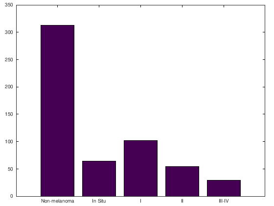

# Naive approaches and decomposition methods in orca

This tutorial covers how to apply naive approaches and decomposition methods in ORCA. It is highly recommended to have previously completed the ['how to' tutorial (Notebook)](orca-tutorial-1.ipynb)/['how to' tutorial (HTML)](orca-tutorial-1.html).

We are going to test these methods using a melanoma diagnosis dataset based on dermatoscopic images. Melanoma is a type of cancer that develops from the pigment-containing cells known as melanocytes. Usually occurring on the skin, early detection and diagnosis is strongly related to survival rates. The dataset is aimed at predicting the severity of the lesion:
- A total of `100` image descriptors are used as input features, including features related to shape, colour, pigment network and texture.
- The severity is assessed in terms of melanoma thickness, measured by the Breslow index. The problem is tackled as a five-class classification problem, where the first class represents benign lesions, and the remaining four classes represent the different stages of the melanoma (0, I, II and III, where III is the thickest one and the most dangerous).


*Graphical representation of the Breslow index (source [1])*

The dataset from [1] is included in this repository, in a specific [folder](/exampledata/10-fold/melanoma-5classes-abcd-100/matlab). The corresponding script for this tutorial, ([exampleMelanoma.m](../src/code-examples/exampleMelanoma.m)), can be found and run in the [code example](../src/code-examples) folder.

## Loading the dataset and performing some preliminary experiments

First, we will load the dataset and examine the label for some of the patterns:


```octave
trainMelanoma = load('../exampledata/10-fold/melanoma-5classes-abcd-100-fs/matlab/train_melanoma-5classes-abcd-100-fs.2');
testMelanoma = load('../exampledata/10-fold/melanoma-5classes-abcd-100-fs/matlab/test_melanoma-5classes-abcd-100-fs.2');
trainMelanoma([1:5 300:305],end)
```

    ans =
    
       1
       1
       1
       1
       1
       2
       2
       2
       2
       2
       2
    


Although the data is prepared to perform a 10-fold experimental design, we are going to examine the properties of the whole set:


```octave
melanoma = [trainMelanoma; testMelanoma];
```

The dataset is quite imbalanced, as you can check with this code:


```octave
labels = {'Non-melanoma', 'In Situ', 'I', 'II', 'III-IV'};
nn = hist(melanoma(:,end),5);
bar(nn)
set (gca, 'xticklabel',labels)
```





---

***Exercise 1***: obtain the average imbalanced ratio for this dataset, where the imbalanced ratio of each class is the sum of the number of patterns of the rest of classes divided by the number of classes times the number of patterns of the class.

---
We can apply a simple method, [POM](../src/Algorithms/POM.m) [2], to check the accuracy (CCR) and MAE obtained for this dataset:


```octave
train.patterns = trainMelanoma(:,1:(end-1));
train.targets = trainMelanoma(:,end);
test.patterns = testMelanoma(:,1:(end-1));
test.targets = testMelanoma(:,end);
addpath('../src/Algorithms/');
algorithmObj = POM();
info = algorithmObj.fitpredict(train,test);
addpath('../src/Measures/');
CCR.calculateMetric(info.predictedTest,test.targets)
MAE.calculateMetric(info.predictedTest,test.targets)
```

    epsilon
     56909.29682
    ans =  0.66071
    ans =  0.51786


In the following code, we try to improve the results by considering standardization:


```octave
addpath('../src/Utils/');
[trainStandarized,testStandarized] = DataSet.standarizeData(train,test);
disp('Some patterns before standarizing')
train.patterns(1:10,2:5)
disp('The same patterns after standarizing')
trainStandarized.patterns(1:10,2:5)
```

    Some patterns before standarizing
    ans =
    
          1.39817    266.63620     68.22989     66.71459
          1.63949   1520.75100     77.41614     97.06574
          1.50760    394.50550     58.38186      0.16893
          1.27778    176.16820     83.20313      1.47513
          1.44320    552.79690     34.28749     22.74991
          1.25702     92.13424     52.84424     49.53449
          1.40287    190.13010     76.44786     91.14979
          1.59847   2333.85600     61.23107      0.00720
          1.51663    454.34930     72.21953      0.00000
          1.34062    149.19010     74.05859     77.66209
    
    The same patterns after standarizing
    ans =
    
      -0.0263804  -0.6159705   0.8400188   1.2639962
       1.1899081   0.3464767   1.3279650   2.2296928
       0.5251951  -0.5178396   0.3169205  -0.8533179
      -0.6331613  -0.6853985   1.6353530  -0.8117580
       0.2005954  -0.3963618  -0.9629005  -0.1348485
      -0.7378061  -0.7498888   0.0227789   0.7173692
      -0.0027065  -0.6746837   1.2765327   2.0414624
       0.9831587   0.9704791   0.4682625  -0.8584636
       0.5706981  -0.4719136   1.0519365  -0.8586928
      -0.3164445  -0.7061023   1.1496218   1.6123181
    


```octave
info = algorithmObj.fitpredict(trainStandarized,testStandarized);
CCR.calculateMetric(info.predictedTest,test.targets)
MAE.calculateMetric(info.predictedTest,test.targets)
```

    epsilon
     0.11250
    ans =  0.66071
    ans =  0.51786


The results have not improved in this specific case. The static method `DataSet.standarizeData(train,test)` transforms the training and test datasets and returns a copy where all the input variables have zero mean and unit standard deviation. There are other pre-processing methods in the `DataSet` class which delete constant input attributes or non numeric attributes:


```octave
[train,test] = DataSet.deleteConstantAtributes(train,test);
[train,test] = DataSet.standarizeData(train,test);
[train,test] = DataSet.deleteNonNumericValues(train,test);
info = algorithmObj.fitpredict(train,test);
CCR.calculateMetric(info.predictedTest,test.targets)
MAE.calculateMetric(info.predictedTest,test.targets)
```

    epsilon
     0.11250
    ans =  0.66071
    ans =  0.51786


Again, the results have not changed, as there were no attributes with these characteristics. However, in general, it is a good idea to apply standardisation of the input variables.

---

***Exercise 2***: construct a function (`preprocess.m`) applying these three pre-processing steps (standarisation, removal of constant features and removal of non numeric values) for future uses.

---

## Naive approaches

The first thing we will do is applying standard approaches for this ordinal regression dataset. This includes applying regression, classification and cost-sensitive classification. In this section we will use kernel methods, that are more suitable for high-dimensional data, so that we can use melanoma dataset with the full set of 100 features:


```octave
trainMelanoma = load('../exampledata/10-fold/melanoma-5classes-abcd-100/matlab/train_melanoma-5classes-abcd-100.2');
testMelanoma = load('../exampledata/10-fold/melanoma-5classes-abcd-100/matlab/test_melanoma-5classes-abcd-100.2');
train.patterns = trainMelanoma(:,1:(end-1));
train.targets = trainMelanoma(:,end);
test.patterns = testMelanoma(:,1:(end-1));
test.targets = testMelanoma(:,end);
[train,test] = DataSet.deleteConstantAtributes(train,test);
[train,test] = DataSet.standarizeData(train,test);
[train,test] = DataSet.deleteNonNumericValues(train,test);
```


### Regression (SVR)

A very simple way of solving an ordinal classification problem is to apply regression. This is, we train a regressor to predict the number of the category (where categories are coded with real consecutive values, `1`, `2`, ..., `Q`, which are scaled between 0 and 1, `0/(Q-1)=0`, `1/(Q-1)`, ..., `(Q-1)/(Q-1)`). Then, to predict categories, we round the real values predicted by the regressor to the nearest integer.

ORCA includes one algorithm following this approach based on support vector machines: [Support Vector Regression (SVR)](../src/Algorithms/SVR.m). Note that SVR considers the epsilon-SVR model with an RBF kernel, involving three different parameters:
- Parameter `C`, importance given to errors.
- Parameter `k`, inverse of the width of the RBF kernel.
- Parameter `e`, epsilon. It specifies the epsilon-tube within which no penalty is associated in the training loss function with points predicted within a distance epsilon from the actual value.

We can check the performance of this model in the melanoma dataset:


```octave
algorithmObj = SVR();
info = algorithmObj.fitpredict(train,test,struct('C',10,'k',0.001,'e',0.01));
fprintf('\nSupport Vector Regression\n---------------\n');
fprintf('SVR Accuracy: %f\n', CCR.calculateMetric(test.targets,info.predictedTest));
fprintf('SVR MAE: %f\n', MAE.calculateMetric(test.targets,info.predictedTest));

```

    
    Support Vector Regression
    ---------------
    SVR Accuracy: 0.678571
    SVR MAE: 0.392857


The object info also contains the projection values, which, in this case, are the real values without being rounded:


```octave
info.projectedTest(1:10)
```

    ans =
    
       0.109167
       0.229370
       0.028311
      -0.047946
       0.121599
       0.051311
       0.313528
       0.125686
       0.105111
       0.106238
    


As you can see, poor performance is obtained. We can try different parameter values by using a `for` loop:


```octave
fprintf('\nSupport Vector Regression parameters\n---------------\n');
bestAccuracy=0;
for C=10.^(-3:1:3)
   for k=10.^(-3:1:3)
       for e=10.^(-3:1:3)
           param = struct('C',C,'k',k,'e',e);
           info = algorithmObj.fitpredict(train,test,param);
           accuracy = CCR.calculateMetric(test.targets,info.predictedTest);
           if accuracy > bestAccuracy
               bestAccuracy = accuracy;
               bestParam = param;
           end
           fprintf('SVR C %f, k %f, e %f --> Accuracy: %f, MAE: %f\n' ...
               , C, k, e, accuracy, MAE.calculateMetric(test.targets,info.predictedTest));
       end
   end
end
fprintf('Best Results SVR C %f, k %f, e %f --> Accuracy: %f\n', bestParam.C, bestParam.k, bestParam.e, bestAccuracy);
```

    
    Support Vector Regression parameters
    ---------------
    SVR C 0.001000, k 0.001000, e 0.001000 --> Accuracy: 0.571429, MAE: 0.892857
    SVR C 0.001000, k 0.001000, e 0.010000 --> Accuracy: 0.571429, MAE: 0.892857
    SVR C 0.001000, k 0.001000, e 0.100000 --> Accuracy: 0.571429, MAE: 0.892857
    SVR C 0.001000, k 0.001000, e 1.000000 --> Accuracy: 0.178571, MAE: 1.428571
    SVR C 0.001000, k 0.001000, e 10.000000 --> Accuracy: 0.178571, MAE: 1.428571
    SVR C 0.001000, k 0.001000, e 100.000000 --> Accuracy: 0.178571, MAE: 1.428571
    SVR C 0.001000, k 0.001000, e 1000.000000 --> Accuracy: 0.178571, MAE: 1.428571
    SVR C 0.001000, k 0.010000, e 0.001000 --> Accuracy: 0.571429, MAE: 0.892857
    SVR C 0.001000, k 0.010000, e 0.010000 --> Accuracy: 0.571429, MAE: 0.892857
    SVR C 0.001000, k 0.010000, e 0.100000 --> Accuracy: 0.571429, MAE: 0.892857
    SVR C 0.001000, k 0.010000, e 1.000000 --> Accuracy: 0.178571, MAE: 1.428571
    SVR C 0.001000, k 0.010000, e 10.000000 --> Accuracy: 0.178571, MAE: 1.428571
    SVR C 0.001000, k 0.010000, e 100.000000 --> Accuracy: 0.178571, MAE: 1.428571
    SVR C 0.001000, k 0.010000, e 1000.000000 --> Accuracy: 0.178571, MAE: 1.428571
    SVR C 0.001000, k 0.100000, e 0.001000 --> Accuracy: 0.571429, MAE: 0.892857
    SVR C 0.001000, k 0.100000, e 0.010000 --> Accuracy: 0.571429, MAE: 0.892857
    SVR C 0.001000, k 0.100000, e 0.100000 --> Accuracy: 0.571429, MAE: 0.892857
    SVR C 0.001000, k 0.100000, e 1.000000 --> Accuracy: 0.178571, MAE: 1.428571
    SVR C 0.001000, k 0.100000, e 10.000000 --> Accuracy: 0.178571, MAE: 1.428571
    SVR C 0.001000, k 0.100000, e 100.000000 --> Accuracy: 0.178571, MAE: 1.428571
    SVR C 0.001000, k 0.100000, e 1000.000000 --> Accuracy: 0.178571, MAE: 1.428571
    SVR C 0.001000, k 1.000000, e 0.001000 --> Accuracy: 0.571429, MAE: 0.892857
    SVR C 0.001000, k 1.000000, e 0.010000 --> Accuracy: 0.571429, MAE: 0.892857
    SVR C 0.001000, k 1.000000, e 0.100000 --> Accuracy: 0.571429, MAE: 0.892857
    SVR C 0.001000, k 1.000000, e 1.000000 --> Accuracy: 0.178571, MAE: 1.428571
    SVR C 0.001000, k 1.000000, e 10.000000 --> Accuracy: 0.178571, MAE: 1.428571
    SVR C 0.001000, k 1.000000, e 100.000000 --> Accuracy: 0.178571, MAE: 1.428571
    SVR C 0.001000, k 1.000000, e 1000.000000 --> Accuracy: 0.178571, MAE: 1.428571
    SVR C 0.001000, k 10.000000, e 0.001000 --> Accuracy: 0.571429, MAE: 0.892857
    SVR C 0.001000, k 10.000000, e 0.010000 --> Accuracy: 0.571429, MAE: 0.892857
    SVR C 0.001000, k 10.000000, e 0.100000 --> Accuracy: 0.571429, MAE: 0.892857
    SVR C 0.001000, k 10.000000, e 1.000000 --> Accuracy: 0.178571, MAE: 1.428571
    SVR C 0.001000, k 10.000000, e 10.000000 --> Accuracy: 0.178571, MAE: 1.428571
    SVR C 0.001000, k 10.000000, e 100.000000 --> Accuracy: 0.178571, MAE: 1.428571
    SVR C 0.001000, k 10.000000, e 1000.000000 --> Accuracy: 0.178571, MAE: 1.428571
    SVR C 0.001000, k 100.000000, e 0.001000 --> Accuracy: 0.571429, MAE: 0.892857
    SVR C 0.001000, k 100.000000, e 0.010000 --> Accuracy: 0.571429, MAE: 0.892857
    SVR C 0.001000, k 100.000000, e 0.100000 --> Accuracy: 0.571429, MAE: 0.892857
    SVR C 0.001000, k 100.000000, e 1.000000 --> Accuracy: 0.178571, MAE: 1.428571
    SVR C 0.001000, k 100.000000, e 10.000000 --> Accuracy: 0.178571, MAE: 1.428571
    SVR C 0.001000, k 100.000000, e 100.000000 --> Accuracy: 0.178571, MAE: 1.428571
    SVR C 0.001000, k 100.000000, e 1000.000000 --> Accuracy: 0.178571, MAE: 1.428571
    SVR C 0.001000, k 1000.000000, e 0.001000 --> Accuracy: 0.571429, MAE: 0.892857
    SVR C 0.001000, k 1000.000000, e 0.010000 --> Accuracy: 0.571429, MAE: 0.892857
    SVR C 0.001000, k 1000.000000, e 0.100000 --> Accuracy: 0.571429, MAE: 0.892857
    SVR C 0.001000, k 1000.000000, e 1.000000 --> Accuracy: 0.178571, MAE: 1.428571
    SVR C 0.001000, k 1000.000000, e 10.000000 --> Accuracy: 0.178571, MAE: 1.428571
    SVR C 0.001000, k 1000.000000, e 100.000000 --> Accuracy: 0.178571, MAE: 1.428571
    SVR C 0.001000, k 1000.000000, e 1000.000000 --> Accuracy: 0.178571, MAE: 1.428571
    SVR C 0.010000, k 0.001000, e 0.001000 --> Accuracy: 0.571429, MAE: 0.892857
    SVR C 0.010000, k 0.001000, e 0.010000 --> Accuracy: 0.571429, MAE: 0.892857
    SVR C 0.010000, k 0.001000, e 0.100000 --> Accuracy: 0.517857, MAE: 0.732143
    SVR C 0.010000, k 0.001000, e 1.000000 --> Accuracy: 0.178571, MAE: 1.428571
    SVR C 0.010000, k 0.001000, e 10.000000 --> Accuracy: 0.178571, MAE: 1.428571
    SVR C 0.010000, k 0.001000, e 100.000000 --> Accuracy: 0.178571, MAE: 1.428571
    SVR C 0.010000, k 0.001000, e 1000.000000 --> Accuracy: 0.178571, MAE: 1.428571
    SVR C 0.010000, k 0.010000, e 0.001000 --> Accuracy: 0.607143, MAE: 0.732143
    SVR C 0.010000, k 0.010000, e 0.010000 --> Accuracy: 0.589286, MAE: 0.732143
    SVR C 0.010000, k 0.010000, e 0.100000 --> Accuracy: 0.482143, MAE: 0.732143
    SVR C 0.010000, k 0.010000, e 1.000000 --> Accuracy: 0.178571, MAE: 1.428571
    SVR C 0.010000, k 0.010000, e 10.000000 --> Accuracy: 0.178571, MAE: 1.428571
    SVR C 0.010000, k 0.010000, e 100.000000 --> Accuracy: 0.178571, MAE: 1.428571
    SVR C 0.010000, k 0.010000, e 1000.000000 --> Accuracy: 0.178571, MAE: 1.428571
    SVR C 0.010000, k 0.100000, e 0.001000 --> Accuracy: 0.571429, MAE: 0.892857
    SVR C 0.010000, k 0.100000, e 0.010000 --> Accuracy: 0.571429, MAE: 0.892857
    SVR C 0.010000, k 0.100000, e 0.100000 --> Accuracy: 0.571429, MAE: 0.892857
    SVR C 0.010000, k 0.100000, e 1.000000 --> Accuracy: 0.178571, MAE: 1.428571
    SVR C 0.010000, k 0.100000, e 10.000000 --> Accuracy: 0.178571, MAE: 1.428571
    SVR C 0.010000, k 0.100000, e 100.000000 --> Accuracy: 0.178571, MAE: 1.428571
    SVR C 0.010000, k 0.100000, e 1000.000000 --> Accuracy: 0.178571, MAE: 1.428571
    SVR C 0.010000, k 1.000000, e 0.001000 --> Accuracy: 0.571429, MAE: 0.892857
    SVR C 0.010000, k 1.000000, e 0.010000 --> Accuracy: 0.571429, MAE: 0.892857
    SVR C 0.010000, k 1.000000, e 0.100000 --> Accuracy: 0.571429, MAE: 0.892857
    SVR C 0.010000, k 1.000000, e 1.000000 --> Accuracy: 0.178571, MAE: 1.428571
    SVR C 0.010000, k 1.000000, e 10.000000 --> Accuracy: 0.178571, MAE: 1.428571
    SVR C 0.010000, k 1.000000, e 100.000000 --> Accuracy: 0.178571, MAE: 1.428571
    SVR C 0.010000, k 1.000000, e 1000.000000 --> Accuracy: 0.178571, MAE: 1.428571
    SVR C 0.010000, k 10.000000, e 0.001000 --> Accuracy: 0.571429, MAE: 0.892857
    SVR C 0.010000, k 10.000000, e 0.010000 --> Accuracy: 0.571429, MAE: 0.892857
    SVR C 0.010000, k 10.000000, e 0.100000 --> Accuracy: 0.571429, MAE: 0.892857
    SVR C 0.010000, k 10.000000, e 1.000000 --> Accuracy: 0.178571, MAE: 1.428571
    SVR C 0.010000, k 10.000000, e 10.000000 --> Accuracy: 0.178571, MAE: 1.428571
    SVR C 0.010000, k 10.000000, e 100.000000 --> Accuracy: 0.178571, MAE: 1.428571
    SVR C 0.010000, k 10.000000, e 1000.000000 --> Accuracy: 0.178571, MAE: 1.428571
    SVR C 0.010000, k 100.000000, e 0.001000 --> Accuracy: 0.571429, MAE: 0.892857
    SVR C 0.010000, k 100.000000, e 0.010000 --> Accuracy: 0.571429, MAE: 0.892857
    SVR C 0.010000, k 100.000000, e 0.100000 --> Accuracy: 0.571429, MAE: 0.892857
    SVR C 0.010000, k 100.000000, e 1.000000 --> Accuracy: 0.178571, MAE: 1.428571
    SVR C 0.010000, k 100.000000, e 10.000000 --> Accuracy: 0.178571, MAE: 1.428571
    SVR C 0.010000, k 100.000000, e 100.000000 --> Accuracy: 0.178571, MAE: 1.428571
    SVR C 0.010000, k 100.000000, e 1000.000000 --> Accuracy: 0.178571, MAE: 1.428571
    SVR C 0.010000, k 1000.000000, e 0.001000 --> Accuracy: 0.571429, MAE: 0.892857
    SVR C 0.010000, k 1000.000000, e 0.010000 --> Accuracy: 0.571429, MAE: 0.892857
    SVR C 0.010000, k 1000.000000, e 0.100000 --> Accuracy: 0.571429, MAE: 0.892857
    SVR C 0.010000, k 1000.000000, e 1.000000 --> Accuracy: 0.178571, MAE: 1.428571
    SVR C 0.010000, k 1000.000000, e 10.000000 --> Accuracy: 0.178571, MAE: 1.428571
    SVR C 0.010000, k 1000.000000, e 100.000000 --> Accuracy: 0.178571, MAE: 1.428571
    SVR C 0.010000, k 1000.000000, e 1000.000000 --> Accuracy: 0.178571, MAE: 1.428571
    SVR C 0.100000, k 0.001000, e 0.001000 --> Accuracy: 0.517857, MAE: 0.642857
    SVR C 0.100000, k 0.001000, e 0.010000 --> Accuracy: 0.517857, MAE: 0.660714
    SVR C 0.100000, k 0.001000, e 0.100000 --> Accuracy: 0.464286, MAE: 0.660714
    SVR C 0.100000, k 0.001000, e 1.000000 --> Accuracy: 0.178571, MAE: 1.428571
    SVR C 0.100000, k 0.001000, e 10.000000 --> Accuracy: 0.178571, MAE: 1.428571
    SVR C 0.100000, k 0.001000, e 100.000000 --> Accuracy: 0.178571, MAE: 1.428571
    SVR C 0.100000, k 0.001000, e 1000.000000 --> Accuracy: 0.178571, MAE: 1.428571
    SVR C 0.100000, k 0.010000, e 0.001000 --> Accuracy: 0.553571, MAE: 0.571429
    SVR C 0.100000, k 0.010000, e 0.010000 --> Accuracy: 0.535714, MAE: 0.589286
    SVR C 0.100000, k 0.010000, e 0.100000 --> Accuracy: 0.517857, MAE: 0.571429
    SVR C 0.100000, k 0.010000, e 1.000000 --> Accuracy: 0.178571, MAE: 1.428571
    SVR C 0.100000, k 0.010000, e 10.000000 --> Accuracy: 0.178571, MAE: 1.428571
    SVR C 0.100000, k 0.010000, e 100.000000 --> Accuracy: 0.178571, MAE: 1.428571
    SVR C 0.100000, k 0.010000, e 1000.000000 --> Accuracy: 0.178571, MAE: 1.428571
    SVR C 0.100000, k 0.100000, e 0.001000 --> Accuracy: 0.571429, MAE: 0.875000
    SVR C 0.100000, k 0.100000, e 0.010000 --> Accuracy: 0.553571, MAE: 0.857143
    SVR C 0.100000, k 0.100000, e 0.100000 --> Accuracy: 0.107143, MAE: 1.053571
    SVR C 0.100000, k 0.100000, e 1.000000 --> Accuracy: 0.178571, MAE: 1.428571
    SVR C 0.100000, k 0.100000, e 10.000000 --> Accuracy: 0.178571, MAE: 1.428571
    SVR C 0.100000, k 0.100000, e 100.000000 --> Accuracy: 0.178571, MAE: 1.428571
    SVR C 0.100000, k 0.100000, e 1000.000000 --> Accuracy: 0.178571, MAE: 1.428571
    SVR C 0.100000, k 1.000000, e 0.001000 --> Accuracy: 0.571429, MAE: 0.892857
    SVR C 0.100000, k 1.000000, e 0.010000 --> Accuracy: 0.571429, MAE: 0.892857
    SVR C 0.100000, k 1.000000, e 0.100000 --> Accuracy: 0.125000, MAE: 1.035714
    SVR C 0.100000, k 1.000000, e 1.000000 --> Accuracy: 0.178571, MAE: 1.428571
    SVR C 0.100000, k 1.000000, e 10.000000 --> Accuracy: 0.178571, MAE: 1.428571
    SVR C 0.100000, k 1.000000, e 100.000000 --> Accuracy: 0.178571, MAE: 1.428571
    SVR C 0.100000, k 1.000000, e 1000.000000 --> Accuracy: 0.178571, MAE: 1.428571
    SVR C 0.100000, k 10.000000, e 0.001000 --> Accuracy: 0.571429, MAE: 0.892857
    SVR C 0.100000, k 10.000000, e 0.010000 --> Accuracy: 0.571429, MAE: 0.892857
    SVR C 0.100000, k 10.000000, e 0.100000 --> Accuracy: 0.125000, MAE: 1.035714
    SVR C 0.100000, k 10.000000, e 1.000000 --> Accuracy: 0.178571, MAE: 1.428571
    SVR C 0.100000, k 10.000000, e 10.000000 --> Accuracy: 0.178571, MAE: 1.428571
    SVR C 0.100000, k 10.000000, e 100.000000 --> Accuracy: 0.178571, MAE: 1.428571
    SVR C 0.100000, k 10.000000, e 1000.000000 --> Accuracy: 0.178571, MAE: 1.428571
    SVR C 0.100000, k 100.000000, e 0.001000 --> Accuracy: 0.571429, MAE: 0.892857
    SVR C 0.100000, k 100.000000, e 0.010000 --> Accuracy: 0.571429, MAE: 0.892857
    SVR C 0.100000, k 100.000000, e 0.100000 --> Accuracy: 0.125000, MAE: 1.035714
    SVR C 0.100000, k 100.000000, e 1.000000 --> Accuracy: 0.178571, MAE: 1.428571
    SVR C 0.100000, k 100.000000, e 10.000000 --> Accuracy: 0.178571, MAE: 1.428571
    SVR C 0.100000, k 100.000000, e 100.000000 --> Accuracy: 0.178571, MAE: 1.428571
    SVR C 0.100000, k 100.000000, e 1000.000000 --> Accuracy: 0.178571, MAE: 1.428571
    SVR C 0.100000, k 1000.000000, e 0.001000 --> Accuracy: 0.571429, MAE: 0.892857
    SVR C 0.100000, k 1000.000000, e 0.010000 --> Accuracy: 0.571429, MAE: 0.892857
    SVR C 0.100000, k 1000.000000, e 0.100000 --> Accuracy: 0.125000, MAE: 1.035714
    SVR C 0.100000, k 1000.000000, e 1.000000 --> Accuracy: 0.178571, MAE: 1.428571
    SVR C 0.100000, k 1000.000000, e 10.000000 --> Accuracy: 0.178571, MAE: 1.428571
    SVR C 0.100000, k 1000.000000, e 100.000000 --> Accuracy: 0.178571, MAE: 1.428571
    SVR C 0.100000, k 1000.000000, e 1000.000000 --> Accuracy: 0.178571, MAE: 1.428571
    SVR C 1.000000, k 0.001000, e 0.001000 --> Accuracy: 0.625000, MAE: 0.482143
    SVR C 1.000000, k 0.001000, e 0.010000 --> Accuracy: 0.589286, MAE: 0.517857
    SVR C 1.000000, k 0.001000, e 0.100000 --> Accuracy: 0.589286, MAE: 0.482143
    SVR C 1.000000, k 0.001000, e 1.000000 --> Accuracy: 0.178571, MAE: 1.428571
    SVR C 1.000000, k 0.001000, e 10.000000 --> Accuracy: 0.178571, MAE: 1.428571
    SVR C 1.000000, k 0.001000, e 100.000000 --> Accuracy: 0.178571, MAE: 1.428571
    SVR C 1.000000, k 0.001000, e 1000.000000 --> Accuracy: 0.178571, MAE: 1.428571
    SVR C 1.000000, k 0.010000, e 0.001000 --> Accuracy: 0.535714, MAE: 0.535714
    SVR C 1.000000, k 0.010000, e 0.010000 --> Accuracy: 0.535714, MAE: 0.553571
    SVR C 1.000000, k 0.010000, e 0.100000 --> Accuracy: 0.500000, MAE: 0.589286
    SVR C 1.000000, k 0.010000, e 1.000000 --> Accuracy: 0.178571, MAE: 1.428571
    SVR C 1.000000, k 0.010000, e 10.000000 --> Accuracy: 0.178571, MAE: 1.428571
    SVR C 1.000000, k 0.010000, e 100.000000 --> Accuracy: 0.178571, MAE: 1.428571
    SVR C 1.000000, k 0.010000, e 1000.000000 --> Accuracy: 0.178571, MAE: 1.428571
    SVR C 1.000000, k 0.100000, e 0.001000 --> Accuracy: 0.142857, MAE: 1.035714
    SVR C 1.000000, k 0.100000, e 0.010000 --> Accuracy: 0.142857, MAE: 1.035714
    SVR C 1.000000, k 0.100000, e 0.100000 --> Accuracy: 0.142857, MAE: 1.035714
    SVR C 1.000000, k 0.100000, e 1.000000 --> Accuracy: 0.178571, MAE: 1.428571
    SVR C 1.000000, k 0.100000, e 10.000000 --> Accuracy: 0.178571, MAE: 1.428571
    SVR C 1.000000, k 0.100000, e 100.000000 --> Accuracy: 0.178571, MAE: 1.428571
    SVR C 1.000000, k 0.100000, e 1000.000000 --> Accuracy: 0.178571, MAE: 1.428571
    SVR C 1.000000, k 1.000000, e 0.001000 --> Accuracy: 0.125000, MAE: 1.035714
    SVR C 1.000000, k 1.000000, e 0.010000 --> Accuracy: 0.125000, MAE: 1.035714
    SVR C 1.000000, k 1.000000, e 0.100000 --> Accuracy: 0.125000, MAE: 1.035714
    SVR C 1.000000, k 1.000000, e 1.000000 --> Accuracy: 0.178571, MAE: 1.428571
    SVR C 1.000000, k 1.000000, e 10.000000 --> Accuracy: 0.178571, MAE: 1.428571
    SVR C 1.000000, k 1.000000, e 100.000000 --> Accuracy: 0.178571, MAE: 1.428571
    SVR C 1.000000, k 1.000000, e 1000.000000 --> Accuracy: 0.178571, MAE: 1.428571
    SVR C 1.000000, k 10.000000, e 0.001000 --> Accuracy: 0.125000, MAE: 1.035714
    SVR C 1.000000, k 10.000000, e 0.010000 --> Accuracy: 0.125000, MAE: 1.035714
    SVR C 1.000000, k 10.000000, e 0.100000 --> Accuracy: 0.125000, MAE: 1.035714
    SVR C 1.000000, k 10.000000, e 1.000000 --> Accuracy: 0.178571, MAE: 1.428571
    SVR C 1.000000, k 10.000000, e 10.000000 --> Accuracy: 0.178571, MAE: 1.428571
    SVR C 1.000000, k 10.000000, e 100.000000 --> Accuracy: 0.178571, MAE: 1.428571
    SVR C 1.000000, k 10.000000, e 1000.000000 --> Accuracy: 0.178571, MAE: 1.428571
    SVR C 1.000000, k 100.000000, e 0.001000 --> Accuracy: 0.125000, MAE: 1.035714
    SVR C 1.000000, k 100.000000, e 0.010000 --> Accuracy: 0.125000, MAE: 1.035714
    SVR C 1.000000, k 100.000000, e 0.100000 --> Accuracy: 0.125000, MAE: 1.035714
    SVR C 1.000000, k 100.000000, e 1.000000 --> Accuracy: 0.178571, MAE: 1.428571
    SVR C 1.000000, k 100.000000, e 10.000000 --> Accuracy: 0.178571, MAE: 1.428571
    SVR C 1.000000, k 100.000000, e 100.000000 --> Accuracy: 0.178571, MAE: 1.428571
    SVR C 1.000000, k 100.000000, e 1000.000000 --> Accuracy: 0.178571, MAE: 1.428571
    SVR C 1.000000, k 1000.000000, e 0.001000 --> Accuracy: 0.125000, MAE: 1.035714
    SVR C 1.000000, k 1000.000000, e 0.010000 --> Accuracy: 0.125000, MAE: 1.035714
    SVR C 1.000000, k 1000.000000, e 0.100000 --> Accuracy: 0.125000, MAE: 1.035714
    SVR C 1.000000, k 1000.000000, e 1.000000 --> Accuracy: 0.178571, MAE: 1.428571
    SVR C 1.000000, k 1000.000000, e 10.000000 --> Accuracy: 0.178571, MAE: 1.428571
    SVR C 1.000000, k 1000.000000, e 100.000000 --> Accuracy: 0.178571, MAE: 1.428571
    SVR C 1.000000, k 1000.000000, e 1000.000000 --> Accuracy: 0.178571, MAE: 1.428571
    SVR C 10.000000, k 0.001000, e 0.001000 --> Accuracy: 0.660714, MAE: 0.410714
    SVR C 10.000000, k 0.001000, e 0.010000 --> Accuracy: 0.678571, MAE: 0.392857
    SVR C 10.000000, k 0.001000, e 0.100000 --> Accuracy: 0.678571, MAE: 0.375000
    SVR C 10.000000, k 0.001000, e 1.000000 --> Accuracy: 0.178571, MAE: 1.428571
    SVR C 10.000000, k 0.001000, e 10.000000 --> Accuracy: 0.178571, MAE: 1.428571
    SVR C 10.000000, k 0.001000, e 100.000000 --> Accuracy: 0.178571, MAE: 1.428571
    SVR C 10.000000, k 0.001000, e 1000.000000 --> Accuracy: 0.178571, MAE: 1.428571
    SVR C 10.000000, k 0.010000, e 0.001000 --> Accuracy: 0.535714, MAE: 0.589286
    SVR C 10.000000, k 0.010000, e 0.010000 --> Accuracy: 0.535714, MAE: 0.589286
    SVR C 10.000000, k 0.010000, e 0.100000 --> Accuracy: 0.500000, MAE: 0.625000
    SVR C 10.000000, k 0.010000, e 1.000000 --> Accuracy: 0.178571, MAE: 1.428571
    SVR C 10.000000, k 0.010000, e 10.000000 --> Accuracy: 0.178571, MAE: 1.428571
    SVR C 10.000000, k 0.010000, e 100.000000 --> Accuracy: 0.178571, MAE: 1.428571
    SVR C 10.000000, k 0.010000, e 1000.000000 --> Accuracy: 0.178571, MAE: 1.428571
    SVR C 10.000000, k 0.100000, e 0.001000 --> Accuracy: 0.142857, MAE: 1.035714
    SVR C 10.000000, k 0.100000, e 0.010000 --> Accuracy: 0.142857, MAE: 1.035714
    SVR C 10.000000, k 0.100000, e 0.100000 --> Accuracy: 0.142857, MAE: 1.035714
    SVR C 10.000000, k 0.100000, e 1.000000 --> Accuracy: 0.178571, MAE: 1.428571
    SVR C 10.000000, k 0.100000, e 10.000000 --> Accuracy: 0.178571, MAE: 1.428571
    SVR C 10.000000, k 0.100000, e 100.000000 --> Accuracy: 0.178571, MAE: 1.428571
    SVR C 10.000000, k 0.100000, e 1000.000000 --> Accuracy: 0.178571, MAE: 1.428571
    SVR C 10.000000, k 1.000000, e 0.001000 --> Accuracy: 0.125000, MAE: 1.035714
    SVR C 10.000000, k 1.000000, e 0.010000 --> Accuracy: 0.125000, MAE: 1.035714
    SVR C 10.000000, k 1.000000, e 0.100000 --> Accuracy: 0.125000, MAE: 1.035714
    SVR C 10.000000, k 1.000000, e 1.000000 --> Accuracy: 0.178571, MAE: 1.428571
    SVR C 10.000000, k 1.000000, e 10.000000 --> Accuracy: 0.178571, MAE: 1.428571
    SVR C 10.000000, k 1.000000, e 100.000000 --> Accuracy: 0.178571, MAE: 1.428571
    SVR C 10.000000, k 1.000000, e 1000.000000 --> Accuracy: 0.178571, MAE: 1.428571
    SVR C 10.000000, k 10.000000, e 0.001000 --> Accuracy: 0.125000, MAE: 1.035714
    SVR C 10.000000, k 10.000000, e 0.010000 --> Accuracy: 0.125000, MAE: 1.035714
    SVR C 10.000000, k 10.000000, e 0.100000 --> Accuracy: 0.125000, MAE: 1.035714
    SVR C 10.000000, k 10.000000, e 1.000000 --> Accuracy: 0.178571, MAE: 1.428571
    SVR C 10.000000, k 10.000000, e 10.000000 --> Accuracy: 0.178571, MAE: 1.428571
    SVR C 10.000000, k 10.000000, e 100.000000 --> Accuracy: 0.178571, MAE: 1.428571
    SVR C 10.000000, k 10.000000, e 1000.000000 --> Accuracy: 0.178571, MAE: 1.428571
    SVR C 10.000000, k 100.000000, e 0.001000 --> Accuracy: 0.125000, MAE: 1.035714
    SVR C 10.000000, k 100.000000, e 0.010000 --> Accuracy: 0.125000, MAE: 1.035714
    SVR C 10.000000, k 100.000000, e 0.100000 --> Accuracy: 0.125000, MAE: 1.035714
    SVR C 10.000000, k 100.000000, e 1.000000 --> Accuracy: 0.178571, MAE: 1.428571
    SVR C 10.000000, k 100.000000, e 10.000000 --> Accuracy: 0.178571, MAE: 1.428571
    SVR C 10.000000, k 100.000000, e 100.000000 --> Accuracy: 0.178571, MAE: 1.428571
    SVR C 10.000000, k 100.000000, e 1000.000000 --> Accuracy: 0.178571, MAE: 1.428571
    SVR C 10.000000, k 1000.000000, e 0.001000 --> Accuracy: 0.125000, MAE: 1.035714
    SVR C 10.000000, k 1000.000000, e 0.010000 --> Accuracy: 0.125000, MAE: 1.035714
    SVR C 10.000000, k 1000.000000, e 0.100000 --> Accuracy: 0.125000, MAE: 1.035714
    SVR C 10.000000, k 1000.000000, e 1.000000 --> Accuracy: 0.178571, MAE: 1.428571
    SVR C 10.000000, k 1000.000000, e 10.000000 --> Accuracy: 0.178571, MAE: 1.428571
    SVR C 10.000000, k 1000.000000, e 100.000000 --> Accuracy: 0.178571, MAE: 1.428571
    SVR C 10.000000, k 1000.000000, e 1000.000000 --> Accuracy: 0.178571, MAE: 1.428571
    SVR C 100.000000, k 0.001000, e 0.001000 --> Accuracy: 0.607143, MAE: 0.428571
    SVR C 100.000000, k 0.001000, e 0.010000 --> Accuracy: 0.625000, MAE: 0.410714
    SVR C 100.000000, k 0.001000, e 0.100000 --> Accuracy: 0.535714, MAE: 0.535714
    SVR C 100.000000, k 0.001000, e 1.000000 --> Accuracy: 0.178571, MAE: 1.428571
    SVR C 100.000000, k 0.001000, e 10.000000 --> Accuracy: 0.178571, MAE: 1.428571
    SVR C 100.000000, k 0.001000, e 100.000000 --> Accuracy: 0.178571, MAE: 1.428571
    SVR C 100.000000, k 0.001000, e 1000.000000 --> Accuracy: 0.178571, MAE: 1.428571
    SVR C 100.000000, k 0.010000, e 0.001000 --> Accuracy: 0.571429, MAE: 0.589286
    SVR C 100.000000, k 0.010000, e 0.010000 --> Accuracy: 0.535714, MAE: 0.607143
    SVR C 100.000000, k 0.010000, e 0.100000 --> Accuracy: 0.517857, MAE: 0.625000
    SVR C 100.000000, k 0.010000, e 1.000000 --> Accuracy: 0.178571, MAE: 1.428571
    SVR C 100.000000, k 0.010000, e 10.000000 --> Accuracy: 0.178571, MAE: 1.428571
    SVR C 100.000000, k 0.010000, e 100.000000 --> Accuracy: 0.178571, MAE: 1.428571
    SVR C 100.000000, k 0.010000, e 1000.000000 --> Accuracy: 0.178571, MAE: 1.428571
    SVR C 100.000000, k 0.100000, e 0.001000 --> Accuracy: 0.142857, MAE: 1.035714
    SVR C 100.000000, k 0.100000, e 0.010000 --> Accuracy: 0.142857, MAE: 1.035714
    SVR C 100.000000, k 0.100000, e 0.100000 --> Accuracy: 0.142857, MAE: 1.035714
    SVR C 100.000000, k 0.100000, e 1.000000 --> Accuracy: 0.178571, MAE: 1.428571
    SVR C 100.000000, k 0.100000, e 10.000000 --> Accuracy: 0.178571, MAE: 1.428571
    SVR C 100.000000, k 0.100000, e 100.000000 --> Accuracy: 0.178571, MAE: 1.428571
    SVR C 100.000000, k 0.100000, e 1000.000000 --> Accuracy: 0.178571, MAE: 1.428571
    SVR C 100.000000, k 1.000000, e 0.001000 --> Accuracy: 0.125000, MAE: 1.035714
    SVR C 100.000000, k 1.000000, e 0.010000 --> Accuracy: 0.125000, MAE: 1.035714
    SVR C 100.000000, k 1.000000, e 0.100000 --> Accuracy: 0.125000, MAE: 1.035714
    SVR C 100.000000, k 1.000000, e 1.000000 --> Accuracy: 0.178571, MAE: 1.428571
    SVR C 100.000000, k 1.000000, e 10.000000 --> Accuracy: 0.178571, MAE: 1.428571
    SVR C 100.000000, k 1.000000, e 100.000000 --> Accuracy: 0.178571, MAE: 1.428571
    SVR C 100.000000, k 1.000000, e 1000.000000 --> Accuracy: 0.178571, MAE: 1.428571
    SVR C 100.000000, k 10.000000, e 0.001000 --> Accuracy: 0.125000, MAE: 1.035714
    SVR C 100.000000, k 10.000000, e 0.010000 --> Accuracy: 0.125000, MAE: 1.035714
    SVR C 100.000000, k 10.000000, e 0.100000 --> Accuracy: 0.125000, MAE: 1.035714
    SVR C 100.000000, k 10.000000, e 1.000000 --> Accuracy: 0.178571, MAE: 1.428571
    SVR C 100.000000, k 10.000000, e 10.000000 --> Accuracy: 0.178571, MAE: 1.428571
    SVR C 100.000000, k 10.000000, e 100.000000 --> Accuracy: 0.178571, MAE: 1.428571
    SVR C 100.000000, k 10.000000, e 1000.000000 --> Accuracy: 0.178571, MAE: 1.428571
    SVR C 100.000000, k 100.000000, e 0.001000 --> Accuracy: 0.125000, MAE: 1.035714
    SVR C 100.000000, k 100.000000, e 0.010000 --> Accuracy: 0.125000, MAE: 1.035714
    SVR C 100.000000, k 100.000000, e 0.100000 --> Accuracy: 0.125000, MAE: 1.035714
    SVR C 100.000000, k 100.000000, e 1.000000 --> Accuracy: 0.178571, MAE: 1.428571
    SVR C 100.000000, k 100.000000, e 10.000000 --> Accuracy: 0.178571, MAE: 1.428571
    SVR C 100.000000, k 100.000000, e 100.000000 --> Accuracy: 0.178571, MAE: 1.428571
    SVR C 100.000000, k 100.000000, e 1000.000000 --> Accuracy: 0.178571, MAE: 1.428571
    SVR C 100.000000, k 1000.000000, e 0.001000 --> Accuracy: 0.125000, MAE: 1.035714
    SVR C 100.000000, k 1000.000000, e 0.010000 --> Accuracy: 0.125000, MAE: 1.035714
    SVR C 100.000000, k 1000.000000, e 0.100000 --> Accuracy: 0.125000, MAE: 1.035714
    SVR C 100.000000, k 1000.000000, e 1.000000 --> Accuracy: 0.178571, MAE: 1.428571
    SVR C 100.000000, k 1000.000000, e 10.000000 --> Accuracy: 0.178571, MAE: 1.428571
    SVR C 100.000000, k 1000.000000, e 100.000000 --> Accuracy: 0.178571, MAE: 1.428571
    SVR C 100.000000, k 1000.000000, e 1000.000000 --> Accuracy: 0.178571, MAE: 1.428571
    SVR C 1000.000000, k 0.001000, e 0.001000 --> Accuracy: 0.607143, MAE: 0.500000
    SVR C 1000.000000, k 0.001000, e 0.010000 --> Accuracy: 0.589286, MAE: 0.517857
    SVR C 1000.000000, k 0.001000, e 0.100000 --> Accuracy: 0.571429, MAE: 0.553571
    SVR C 1000.000000, k 0.001000, e 1.000000 --> Accuracy: 0.178571, MAE: 1.428571
    SVR C 1000.000000, k 0.001000, e 10.000000 --> Accuracy: 0.178571, MAE: 1.428571
    SVR C 1000.000000, k 0.001000, e 100.000000 --> Accuracy: 0.178571, MAE: 1.428571
    SVR C 1000.000000, k 0.001000, e 1000.000000 --> Accuracy: 0.178571, MAE: 1.428571
    SVR C 1000.000000, k 0.010000, e 0.001000 --> Accuracy: 0.571429, MAE: 0.589286
    SVR C 1000.000000, k 0.010000, e 0.010000 --> Accuracy: 0.535714, MAE: 0.607143
    SVR C 1000.000000, k 0.010000, e 0.100000 --> Accuracy: 0.517857, MAE: 0.625000
    SVR C 1000.000000, k 0.010000, e 1.000000 --> Accuracy: 0.178571, MAE: 1.428571
    SVR C 1000.000000, k 0.010000, e 10.000000 --> Accuracy: 0.178571, MAE: 1.428571
    SVR C 1000.000000, k 0.010000, e 100.000000 --> Accuracy: 0.178571, MAE: 1.428571
    SVR C 1000.000000, k 0.010000, e 1000.000000 --> Accuracy: 0.178571, MAE: 1.428571
    SVR C 1000.000000, k 0.100000, e 0.001000 --> Accuracy: 0.142857, MAE: 1.035714
    SVR C 1000.000000, k 0.100000, e 0.010000 --> Accuracy: 0.142857, MAE: 1.035714
    SVR C 1000.000000, k 0.100000, e 0.100000 --> Accuracy: 0.142857, MAE: 1.035714
    SVR C 1000.000000, k 0.100000, e 1.000000 --> Accuracy: 0.178571, MAE: 1.428571
    SVR C 1000.000000, k 0.100000, e 10.000000 --> Accuracy: 0.178571, MAE: 1.428571
    SVR C 1000.000000, k 0.100000, e 100.000000 --> Accuracy: 0.178571, MAE: 1.428571
    SVR C 1000.000000, k 0.100000, e 1000.000000 --> Accuracy: 0.178571, MAE: 1.428571
    SVR C 1000.000000, k 1.000000, e 0.001000 --> Accuracy: 0.125000, MAE: 1.035714
    SVR C 1000.000000, k 1.000000, e 0.010000 --> Accuracy: 0.125000, MAE: 1.035714
    SVR C 1000.000000, k 1.000000, e 0.100000 --> Accuracy: 0.125000, MAE: 1.035714
    SVR C 1000.000000, k 1.000000, e 1.000000 --> Accuracy: 0.178571, MAE: 1.428571
    SVR C 1000.000000, k 1.000000, e 10.000000 --> Accuracy: 0.178571, MAE: 1.428571
    SVR C 1000.000000, k 1.000000, e 100.000000 --> Accuracy: 0.178571, MAE: 1.428571
    SVR C 1000.000000, k 1.000000, e 1000.000000 --> Accuracy: 0.178571, MAE: 1.428571
    SVR C 1000.000000, k 10.000000, e 0.001000 --> Accuracy: 0.125000, MAE: 1.035714
    SVR C 1000.000000, k 10.000000, e 0.010000 --> Accuracy: 0.125000, MAE: 1.035714
    SVR C 1000.000000, k 10.000000, e 0.100000 --> Accuracy: 0.125000, MAE: 1.035714
    SVR C 1000.000000, k 10.000000, e 1.000000 --> Accuracy: 0.178571, MAE: 1.428571
    SVR C 1000.000000, k 10.000000, e 10.000000 --> Accuracy: 0.178571, MAE: 1.428571
    SVR C 1000.000000, k 10.000000, e 100.000000 --> Accuracy: 0.178571, MAE: 1.428571
    SVR C 1000.000000, k 10.000000, e 1000.000000 --> Accuracy: 0.178571, MAE: 1.428571
    SVR C 1000.000000, k 100.000000, e 0.001000 --> Accuracy: 0.125000, MAE: 1.035714
    SVR C 1000.000000, k 100.000000, e 0.010000 --> Accuracy: 0.125000, MAE: 1.035714
    SVR C 1000.000000, k 100.000000, e 0.100000 --> Accuracy: 0.125000, MAE: 1.035714
    SVR C 1000.000000, k 100.000000, e 1.000000 --> Accuracy: 0.178571, MAE: 1.428571
    SVR C 1000.000000, k 100.000000, e 10.000000 --> Accuracy: 0.178571, MAE: 1.428571
    SVR C 1000.000000, k 100.000000, e 100.000000 --> Accuracy: 0.178571, MAE: 1.428571
    SVR C 1000.000000, k 100.000000, e 1000.000000 --> Accuracy: 0.178571, MAE: 1.428571
    SVR C 1000.000000, k 1000.000000, e 0.001000 --> Accuracy: 0.125000, MAE: 1.035714
    SVR C 1000.000000, k 1000.000000, e 0.010000 --> Accuracy: 0.125000, MAE: 1.035714
    SVR C 1000.000000, k 1000.000000, e 0.100000 --> Accuracy: 0.125000, MAE: 1.035714
    SVR C 1000.000000, k 1000.000000, e 1.000000 --> Accuracy: 0.178571, MAE: 1.428571
    SVR C 1000.000000, k 1000.000000, e 10.000000 --> Accuracy: 0.178571, MAE: 1.428571
    SVR C 1000.000000, k 1000.000000, e 100.000000 --> Accuracy: 0.178571, MAE: 1.428571
    SVR C 1000.000000, k 1000.000000, e 1000.000000 --> Accuracy: 0.178571, MAE: 1.428571
    Best Results SVR C 10.000000, k 0.001000, e 0.010000 --> Accuracy: 0.678571


As you can check, the best configuration leads to almost a 70% of accuracy, which is not very bad considering that we have 5 classes.

This way of adjusting the parameters is not fair, as we can be overfitting the test set. The decision of the optimal parameters should be taken without checking test results. This can be done by using nested crossvalidation.

---

***Exercise 3*** : complete the code of the script ([crossvalide.m](tutorial/scripts/crossvalide.m)) for automatising hyper-parameter selection in this problem. The idea is to have a function like this:
``` MATLAB
>> param = crossvalide(algorithmObj,train,5);
>> param

param =

    C: 0.0100
    k: 0.0100
    e: 0.0100
>> fprintf('\nSupport Vector Regression with cross validated parameters\n---------------\n');
fprintf('SVR Accuracy: %f\n', CCR.calculateMetric(test.targets,info.predictedTest));
fprintf('SVR MAE: %f\n', MAE.calculateMetric(test.targets,info.predictedTest));

Support Vector Regression with cross validated parameters
---------------
SVR Accuracy: 0.589286
SVR MAE: 0.732143
```
Although the results are worse, we can be sure that here there is no overfitting.

---

Fortunately, this can be easily done in ORCA by using the `ini` files with the correct format. [svrMelanoma.ini](tutorial/config-files/svrMelanoma.ini) is a configuration file with the following contents:
```ini
;SVR experiments for melanoma
;
; Experiment ID
[svr-mae-tutorial-melanoma]
{general-conf}
seed = 1
; Datasets path
basedir = ../exampledata/10-fold
; Datasets to process (comma separated list or all to process all)
datasets = melanoma-5classes-abcd-100
; Activate data standardization
standarize = true
; Number of folds for the parameters optimization
num_folds = 5
; Crossvalidation metric
cvmetric = ccr

; Method: algorithm and parameter
{algorithm-parameters}
algorithm = SVR
;kernelType = rbf

; Method's hyper-parameter values to optimize
{algorithm-hyper-parameters-to-cv}
C = 10.^(-2:1:2)
k = 10.^(-2:1:2)
e = 10.^(-3:1:0)
```
In this way, we will obtain the results for the 10 partitions. This `ini` file can be run by using the following code (to be run from the `doc` folder):


```octave
Utilities.runExperiments('tutorial/config-files/svrMelanomafs.ini')
```

    warning: addpath: /home/javier/Documentos/uco/SVNAYRNA/orca/src/Utils/Measures: No such file or directory
    warning: called from
        runExperiments at line 55 column 13
    warning: addpath: /home/javier/Documentos/uco/SVNAYRNA/orca/src/Utils/Algorithms: No such file or directory
    warning: called from
        runExperiments at line 56 column 13
    Setting up experiments...
    Running experiment exp-svr-mae-tutorial-melanoma-melanoma-5classes-abcd-100-fs-1.ini
    Running experiment exp-svr-mae-tutorial-melanoma-melanoma-5classes-abcd-100-fs-10.ini
    Running experiment exp-svr-mae-tutorial-melanoma-melanoma-5classes-abcd-100-fs-2.ini
    Running experiment exp-svr-mae-tutorial-melanoma-melanoma-5classes-abcd-100-fs-3.ini
    Running experiment exp-svr-mae-tutorial-melanoma-melanoma-5classes-abcd-100-fs-4.ini
    Running experiment exp-svr-mae-tutorial-melanoma-melanoma-5classes-abcd-100-fs-5.ini
    Running experiment exp-svr-mae-tutorial-melanoma-melanoma-5classes-abcd-100-fs-6.ini
    Running experiment exp-svr-mae-tutorial-melanoma-melanoma-5classes-abcd-100-fs-7.ini
    Running experiment exp-svr-mae-tutorial-melanoma-melanoma-5classes-abcd-100-fs-8.ini
    Running experiment exp-svr-mae-tutorial-melanoma-melanoma-5classes-abcd-100-fs-9.ini
    Calculating results...
    warning: addpath: /home/javier/Documentos/uco/SVNAYRNA/orca/src/Utils/Measures: No such file or directory
    warning: called from
        results at line 141 column 13
        runExperiments at line 98 column 13
    warning: addpath: /home/javier/Documentos/uco/SVNAYRNA/orca/src/Utils/Algorithms: No such file or directory
    warning: called from
        results at line 142 column 13
        runExperiments at line 98 column 13
    Experiments/exp-2019-5-3-14-30-25/Results/melanoma-5classes-abcd-100-fs-svr-mae-tutorial-melanoma/dataset
    warning: rmpath: /home/javier/Documentos/uco/SVNAYRNA/orca/src/Utils/Measures: not found
    warning: called from
        results at line 380 column 13
        runExperiments at line 98 column 13
    warning: rmpath: /home/javier/Documentos/uco/SVNAYRNA/orca/src/Utils/Algorithms: not found
    warning: called from
        results at line 381 column 13
        runExperiments at line 98 column 13
    warning: addpath: /home/javier/Documentos/uco/SVNAYRNA/orca/src/Utils/Measures: No such file or directory
    warning: called from
        results at line 141 column 13
        runExperiments at line 100 column 13
    warning: addpath: /home/javier/Documentos/uco/SVNAYRNA/orca/src/Utils/Algorithms: No such file or directory
    warning: called from
        results at line 142 column 13
        runExperiments at line 100 column 13
    Experiments/exp-2019-5-3-14-30-25/Results/melanoma-5classes-abcd-100-fs-svr-mae-tutorial-melanoma/dataset
    warning: rmpath: /home/javier/Documentos/uco/SVNAYRNA/orca/src/Utils/Measures: not found
    warning: called from
        results at line 380 column 13
        runExperiments at line 100 column 13
    warning: rmpath: /home/javier/Documentos/uco/SVNAYRNA/orca/src/Utils/Algorithms: not found
    warning: called from
        results at line 381 column 13
        runExperiments at line 100 column 13
    ans = Experiments/exp-2019-5-3-14-30-25


Note that the number of experiments is crucial, so the execution can take a considerable amount of time. To accelerate the experiments you can use multiple cores of your CPU with `Utilities.runExperiments('experiments.ini','parallel', true)` (see this [page](orca-parallel.md)).

### Nominal classification (SVC1V1 and SVC1VA)

We can also approach ordinal classification by considering nominal classification, i.e. by ignoring the ordering information. It has been shown that this can make the classifier need more data to learn.

ORCA includes two approaches to perform ordinal classification by nominal classification, both based on the Support Vector Classifier:
- [One-Vs-One (SVC1V1)](../src/Algorithms/SVC1V1.m) [3], where all pairs of classes are compared in different binary SVCs. The prediction is based on majority voting.
- [One-Vs-All (SVC1VA)](../src/Algorithms/SVC1VA.m) [3], where each class is compared against the rest. The class predicted is that with the largest decision function value.

Both methods consider an RBF kernel with the following two parameters:
- Parameter `C`, importance given to errors.
- Parameter `k`, inverse of the width of the RBF kernel.

Now, we run the SVC1V1 method:


```octave
algorithmObj = SVC1V1();
info = algorithmObj.fitpredict(train,test,struct('C',10,'k',0.001));
fprintf('\nSVC1V1\n---------------\n');
fprintf('SVC1V1 Accuracy: %f\n', CCR.calculateMetric(test.targets,info.predictedTest));
fprintf('SVC1V1 MAE: %f\n', MAE.calculateMetric(test.targets,info.predictedTest));
```

    
    SVC1V1
    ---------------
    SVC1V1 Accuracy: 0.678571
    SVC1V1 MAE: 0.517857


In SVC1V1, the decision values have `(Q(Q-1))/2` (the number of combinations of two classes from the set of `Q` possibilities) columns and majority voting is applied.


```octave
info.projectedTest(1:10,:)
```

    ans =
    
     Columns 1 through 7:
    
       0.926074   0.536692   1.024967   1.830303  -0.602659   0.984071   2.016569
       0.781432   0.482145   0.765139   0.899214  -0.519628   0.146724   1.053821
       1.528675   1.504568   1.561044   1.935776  -0.465130   0.043801   0.944491
       1.672826   2.087165   2.060144   1.702189   0.438583   2.397228   2.721777
       1.400823   1.620267   1.327972   1.661743   0.307829   0.668906   1.746674
       1.522858   1.452593   1.731991   1.742870  -0.816676  -0.359383   0.397733
       1.255397   1.143070   1.042698   1.317361  -1.144442  -0.934373  -0.192200
       1.172912   1.379507   1.437137   1.315572   0.013278   0.179874   1.168156
       0.686760   0.745882   1.214429   1.195741   0.293695   1.392134   1.054115
       0.523418   0.692412   0.706582   0.741470   0.185244   0.936942   1.564033
    
     Columns 8 through 10:
    
       1.126951   2.248576   2.797064
       0.816910   1.310837   1.206514
       0.150428   1.624378   2.462877
       1.686543   2.019641   2.294685
       0.394076   1.871991   1.857090
       0.402845   1.284394   0.931703
      -0.512859   0.916138   0.948722
       0.311567   1.752660   1.255249
       1.043376   1.083996   1.188979
       0.669801   1.071577   1.003215
    


We can also try SVC1VA:


```octave
algorithmObj = SVC1VA();
info = algorithmObj.fitpredict(train,test,struct('C',10,'k',0.001));
fprintf('\nSVC1VA\n---------------\n');
fprintf('SVC1VA Accuracy: %f\n', CCR.calculateMetric(test.targets,info.predictedTest));
fprintf('SVC1VA MAE: %f\n', MAE.calculateMetric(test.targets,info.predictedTest));
```

    
    SVC1VA
    ---------------
    SVC1VA Accuracy: 0.660714
    SVC1VA MAE: 0.535714


Five decision values are obtained for each pattern:


```octave
info.projectedTest(1:10,:)
```

    ans =
    
       0.462546  -1.071544  -0.908493  -1.044683  -1.926574
      -0.226527  -1.058268  -1.080394  -1.053184  -1.497083
       1.163881  -1.128640  -1.304918  -1.068402  -1.501780
       1.973975  -1.197629  -1.338739  -1.211381  -1.883198
       0.888686  -1.029075  -1.284270  -0.988469  -1.772721
       1.167493  -1.120933  -1.107723  -1.115342  -1.446582
       0.618121  -1.160749  -1.248624  -0.980550  -1.149154
       0.681678  -0.861655  -1.150944  -1.017109  -1.520761
       0.202775  -0.989939  -0.937921  -1.077725  -1.595495
      -0.051222  -0.964142  -1.198391  -1.072984  -1.301023
    


In this case, SVC1V1 obtains better results.

### Cost sensitive classification (CSSVC)

This is a special case of approaching ordinal classification by nominal classifiers. We can include different misclassification costs in the optimization function, in order to penalize more those mistakes which involve several categories in the ordinal scale. ORCA implements this method using again SVC and specifically the SVC1VA alternative. The costs are included as weights in the patterns, in such a way that, when generating the `Q` binary problems, the patterns of the negative class are given a weight according to the absolute difference (in number of categories) between the positive class and the specific negative class.

The method is called [Cost Sensitive SVC (CSSVC)](../src/Algorithms/CSSVC.m) [3] and considers an RBF kernel with the following two parameters:
- Parameter `C`, importance given to errors.
- Parameter `k`, inverse of the width of the RBF kernel.


```octave
algorithmObj = CSSVC();
info = algorithmObj.fitpredict(train,test,struct('C',10,'k',0.001));
fprintf('\nCSSVC\n---------------\n');
fprintf('CSSVC Accuracy: %f\n', CCR.calculateMetric(test.targets,info.predictedTest));
fprintf('CSSVC MAE: %f\n', MAE.calculateMetric(test.targets,info.predictedTest));
```

    
    CSSVC
    ---------------
    CSSVC Accuracy: 0.660714
    CSSVC MAE: 0.571429


And the structure of decision values is the same than for SVC1VA:


```octave
info.projectedTest(1:10,:)
```

    ans =
    
       0.526466  -1.056019  -0.817306  -1.106751  -2.053652
      -0.245966  -1.067136  -1.091898  -1.069017  -1.570898
       1.272027  -1.127647  -1.363783  -1.096815  -1.770744
       2.012662  -1.210841  -1.448556  -1.348315  -2.044471
       0.997074  -1.037871  -1.339759  -1.004385  -1.932343
       1.188533  -1.118333  -1.165770  -1.190148  -1.586843
       0.607352  -1.152543  -1.266244  -0.984153  -1.107906
       0.817064  -0.859796  -1.156218  -1.089279  -1.663824
       0.235265  -0.967117  -0.944791  -1.125184  -1.773904
       0.017978  -0.973937  -1.218500  -1.116829  -1.373983
    


### Summary of results for naive approaches

### TODO: now SVR does not get the best MAE since the order information is missed in the reduded dataset

We can compare all the results obtained by naive methods in the third partition of the melanoma dataset:
- SVR Accuracy: 0.678571
- SVC1V1 Accuracy: 0.678571
- SVC1VA Accuracy: 0.660714
- CSSVC Accuracy: 0.660714
- SVR MAE: 0.392857
- SVC1V1 MAE: 0.517857
- SVC1VA MAE: 0.535714
- CSSVC MAE: 0.571429

In this case, SVR has definitely obtained the best results. As can be checked, SVC1V1 accuracy is quite high, but it is masking a not so good MAE value.
